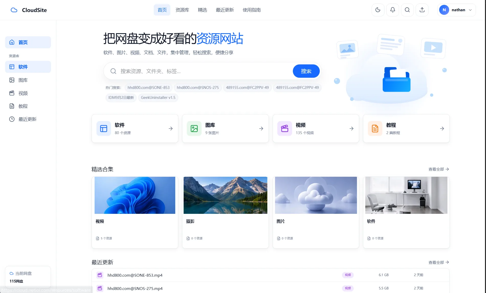

# CloudSite

[](https://github.com/nathanxiangang-web/CloudSite/actions/workflows/ci.yml)
[](https://github.com/nathanxiangang-web/CloudSite/releases)
[](LICENSE)

**CloudSite is a self-hosted resource platform built on cloud drives and cloud storage.**

**CloudSite 是一个以网盘和云存储为底座的自托管资源平台。**

It turns selected storage directories into a searchable resource platform with accounts, previews, collections, sharing, administration, local indexing, and direct-download delivery. CloudSite is the presentation, index, policy, and authorization layer; the underlying storage provider remains responsible for large-file transfer.

> **Stable line:** `v1.0.0`  
> **Current development line:** `v2.0.0-alpha.4`  
> **Live site:** [cloud.netioi.com](https://cloud.netioi.com/)

> `main` and the default `docker-compose.yml` currently track the 2.0 alpha line. For production deployments that require the stable line, pin `CLOUDSITE_IMAGE_TAG=v1.0.0`.

<p align="center">
  
</p>

## What CloudSite provides

- Browse and search indexed resources without proxying large file bodies through CloudSite.
- Preview images, browser-compatible video, PDF, text, Markdown, and common Office documents.
- Keep stable resource identities across supported rename and move operations.
- Organize content with catalogs, collections, metadata, and configurable content roots.
- Provide user accounts, favorites/history, controlled sharing, and administration tools.
- Protect provider credentials with server-side encryption and fail-closed recovery behavior.
- Deploy with Docker Compose on `linux/amd64` and `linux/arm64`.
- Use local indexing and guarded synchronization instead of treating generic AList access as a true delta feed.

## Architecture

```text
Browser
  |
  v
CloudSite Web (Next.js)
  |
  v
CloudSite API (FastAPI)
  |              |
  |              +--> local state / resource index
  |
  +--> AList / storage provider --> HTTP 302 --> file delivery
```

CloudSite normally authorizes a request and redirects the client to the provider path instead of streaming the file itself. This keeps application bandwidth requirements low and lets the storage backend handle transfer performance.

## Technology

- **Web:** Next.js 16, React 19, TypeScript
- **API:** FastAPI, SQLAlchemy, Python 3.12+
- **Data:** SQLite in the current runtime architecture
- **Deployment:** Docker Compose, with optional Traefik HTTPS integration

## Quick start

Requirements: Docker Engine and the Docker Compose plugin. Node.js and Python are not required on the deployment host.

```bash
git clone https://github.com/nathanxiangang-web/CloudSite.git
cd CloudSite
cp .env.example .env
```

Edit `.env` and set at least:

```env
CLOUDSITE_SECRET_KEY=<long-random-secret>
CLOUDSITE_SETUP_TOKEN=<temporary-initial-setup-token>
```

For the current 2.0 alpha images:

```bash
docker compose up -d --wait
docker compose ps
curl -fsS http://127.0.0.1:3000/api/health
```

For the stable 1.0 line, add this to `.env` before starting:

```env
CLOUDSITE_IMAGE_TAG=v1.0.0
```

Open `http://SERVER_IP:3000`. The default Compose file exposes only the Web service; the API remains on the internal Docker network and persistent data is stored under `./data` by default.

After initial setup, remove `CLOUDSITE_SETUP_TOKEN` from `.env` and restart the services. Keep `CLOUDSITE_SECRET_KEY` and `CLOUDSITE_MASTER_KEY` stable after encrypted provider credentials have been saved.

## Documentation

Public repository documentation is intentionally limited to material needed by users, operators, contributors, and integrations:

- [Installation](docs/installation.md)
- [Architecture](docs/architecture.md)
- [User guide](docs/user-guide.md)
- [Administrator guide](docs/admin-guide.md)
- [Public contracts](docs/contracts.md)
- [Deployment, upgrade, and backup](docs/deployment-upgrade-backup.md)
- [Offline installation](docs/offline-installation.md)
- [Operations and disaster recovery](docs/operations-disaster-recovery.md)
- [Recovery guide](docs/recovery-guide.md)
- [FAQ](docs/faq.md)
- [Limitations](docs/limitations.md)
- [Roadmap](docs/ROADMAP.md)
- [Changelog](CHANGELOG.md)

Internal product blueprints, implementation scratchpads, AI-agent context files, and private development notes are not part of the public repository.

## Development

```bash
docker compose -f docker-compose.dev.yml up -d --build
```

The development Compose file exposes Web on port `3000` and API on port `8000`.

Primary checks:

```bash
docker compose -f docker-compose.dev.yml run --rm api pytest
docker compose -f docker-compose.dev.yml run --rm web npm run lint
docker compose -f docker-compose.dev.yml run --rm web npm run typecheck
docker compose -f docker-compose.dev.yml run --rm web npm run build
docker compose config
```

See [CONTRIBUTING.md](CONTRIBUTING.md) before submitting changes.

## Security and data

The repository must not contain production credentials, access tokens, `.env` files, databases, indexes, logs, backups, dependency directories, build artifacts, or private development material.

- Back up persistent state before upgrades.
- Never run `docker compose down -v` against a production instance unless data destruction is intended.
- Provider redirect URLs may be visible to the client because direct delivery uses HTTP redirects.
- Review [Operations and disaster recovery](docs/operations-disaster-recovery.md) and [Limitations](docs/limitations.md) before production deployment.

## Releases

Published versions and offline deployment assets are available from [GitHub Releases](https://github.com/nathanxiangang-web/CloudSite/releases).

`v2.0.0-alpha.4` is an alpha development release. Use the stable `v1.0.0` line when you do not want development-line changes.

## License

CloudSite is released under the [MIT License](LICENSE).
