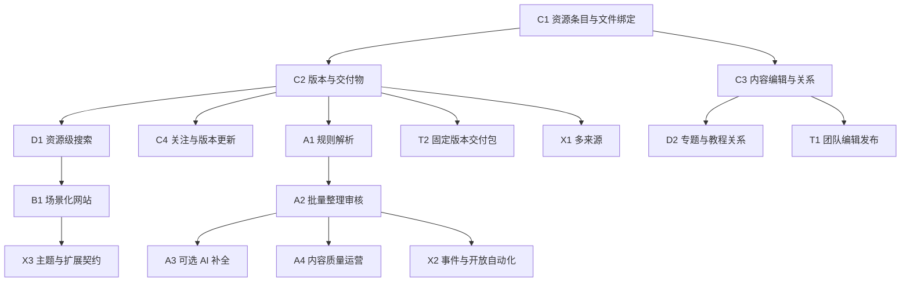

# CloudSite 未来产品开发手册

> 更新：2026-09-10  
> 当前基线：v1.0.0 / `c46a1d94c10d29ba0168f6c5988bc5ce75cdc69c`。  
> 对应蓝图：[CloudSite未来蓝图.md](CloudSite未来蓝图.md)。  
> 本手册重新围绕资源产品、版本交付、自动整理、建站运营和开放生态组织。现存缺陷集中在独立维护章节。模型、接口、模块与排期均为待实施设计。

## 一、开发目标与推进方式

下一阶段要交付的完整故事是：

**维护者把新版本文件放到现有存储中，CloudSite 将其整理为一个资源的新版本；用户打开同一个资源页面，理解用途、选择合适的平台与安装包、查看教程，并关注后续更新。**

先通过人工整理完成这条流程，再用规则与 AI 减少人工工作。网站模板、搜索、运营、外部集成围绕同一个资源中心扩展。

两条工作线并行：

- **产品线**：资源条目、版本与交付物 → 资源发现和建站 → 自动整理 → 团队交付 → 开放集成。
- **维护线**：修复当前认证、恢复、范围、交付等已确认问题，并维护兼容性；详细安排见第十二节。

每个模块都应形成可独立展示、评审和验收的成果。架构调整跟随产品能力发生，不安排一个只拆目录、却没有用户价值的完整大版本。

当前只生成文档，不执行代码改造、部署、发布或外部通知。开发时从实际最新基线检查工作树，保护维护者已有修改；公共 README、Release 与 docs 延续项目英文约定。

### 1.1 角色与交付责任

| 角色 | 负责结果 |
|---|---|
| 产品/架构负责人 | 场景、术语、模块边界、兼容方案和阶段取舍 |
| 实现人员 | 小范围代码、数据迁移、相关测试、实际运行成果和说明 |
| 独立复核人员 | 关键 diff、正常和异常用例、旧数据兼容、恢复与升级 |
| 试点维护者 | 提供真实样本、校验归组和版本语义、判断是否节约维护时间 |

报告必须区分“方案完成、模拟测试通过、真实兼容环境通过、生产验证通过”。页面存在不等于流程完成，所有新能力默认按小范围启用。

## 二、模块总图与首版范围



### 2.1 版本范围

| 阶段 | 必须能展示的结果 | 主要模块 | 后续再完善 |
|---|---|---|---|
| v1.1 资源化 | 一个内容资源挂多个版本/平台文件，用户能正确选包 | C1、C2 最小版、C3 基础字段、D1 基础查询、投稿成果绑定 | 自动镜像切换、复杂标签治理、AI、团队权限 |
| v1.2 网站化 | 无需改源码配置专业资源网站，用户可搜索、专题浏览和关注更新 | D1/D2、B1/B2、C4、G1/G2 | 大型主题市场、任意页面设计器、多租户 |
| v1.3 自动运营 | 批量新文件形成可审核草稿，发布后资源与通知更新 | A1/A2/A4；A3 按试点收益启用 | 无审核自动发布、自动删除底层文件 |
| v1.5 专业协作 | 多维护者分工、固定版本交付、真实第二来源 | T1/T2、X1 选定适配器 | 无限自定义角色、全套项目管理、任意 Provider |
| v2.0 生态候选 | 外部发布系统和非核心贡献者能扩展 CloudSite | X2/X3、稳定 API 与示例扩展 | 市场、托管、多站点须另有需求与预算 |

### 2.2 近期工作量估算

人日为熟悉项目的工程师有效工作时间，包含相关测试和说明；不含等待试点、上游兼容排障和发布观察。估算应在首个垂直切片后重估。

| 模块 | 范围 | 参考人日 |
|---|---|---|
| C1 | 最小资源条目、默认发布、绑定、详情页、迁移和导出基础 | 5–8 |
| C2 首版 | 多版本、多平台资产选择、单个已绑定位置下载 | 5–8 |
| C3 基础 | 说明、别名、标签、编辑冲突及索引投影 | 3–5 |
| D1 首版 | 独立资源搜索、基础筛选、文件结果兼容 | 3–5 |
| 投稿绑定 | 现有审核状态与实际文件/内容成果关联 | 2–3 |
| 首版综合验收 | 混合样本、旧链接、恢复、核心浏览器旅程 | 3–5 |

首个产品版本约 21–34 人日，另加维护线和试点等待。两名工程师可以并行，但建议以第 1–3 个月为整体窗口；单人或兼职顺延。C2 的自动镜像切换、C3 的复杂关系、主题编辑器等不得悄悄塞入首版。

前 90 天与蓝图一致：1–2 周定义样本与领域；3–6 周交付资源条目和绑定；7–10 周完善版本选择、检索和专题；11–12 周完成恢复/导出与试点复盘，试用规则解析。

## 三、最重要的领域演进：内容资源与文件分离

### 3.1 术语必须统一

| 术语 | 意义 | 容易混淆的情况 |
|---|---|---|
| 文件 / File | 存储中一个具体文件；现有 Resource/ResourceIdentity | 现有 resource_id 不能突然改成软件 ID |
| 内容资源 / CatalogEntry | 一款软件、一份教程、一组内容的稳定介绍主体 | 标题相同不代表同一资源 |
| 发布版本 / CatalogRelease | 该资源的一次逻辑发布或修订 | 不强制 SemVer，不能按字符串排序判定最新版 |
| 交付物 / DistributionAsset | 特定平台、架构、语言、包型的一个具体交付物 | Windows x64 与 ARM64 是不同交付物 |
| 存储位置 / AssetLocation | 一个交付物的物理副本，关联现有文件 ID | 镜像必须是同一交付物，不能是另一个构建 |
| 内容修订 / revision | 对介绍、标签、状态等业务数据的一次修改版本 | 与软件版本号、文件上游修改时间分开 |

面向非软件内容，可以使用明确的无版本发布记录，或者按日期/修订命名。后台用适合场景的字段名称，不能强迫图片、教程填写操作系统和 CPU 架构。

### 3.2 最小权威数据模型

以下实体存入 `state.db`，文件事实继续位于 `index.db`；实际命名与迁移号在实施任务中确定。

| 实体 | 建议字段 | 约束 |
|---|---|---|
| CatalogEntry | entry_id、kind、title、aliases、summary、body、source_url、usage_rights_note、status、revision、时间与编辑者 | 独立主键；标题非唯一；草稿默认不发布 |
| CatalogRelease | release_id、entry_id、release_key、display_version、channel、release_date、notes、status、sort_order | `(entry_id, release_key)` 唯一；显式推荐稳定版本；允许 unversioned |
| DistributionAsset | asset_id、release_id、variant_key、platform、architecture、language、package_type、build_label、expected_hash/size、status | `(release_id, variant_key)` 唯一；unknown/universal 明确区分，缺省不猜 Windows/x64 |
| AssetLocation | location_id、asset_id、file_id、绑定时内容指纹/上游对象版本、priority、verification_state、verified_at、enabled | `(asset_id, file_id)` 唯一；file_id 引用同在 state 的 ResourceIdentity；ID 不替代内容版本验证 |
| CatalogTag / CatalogEntryTag | 标签 ID、规范化名、展示名、entry_id | 受控规范化、关系唯一；首版不做无限层级分类 |
| CatalogRelation | source_entry_id、target_entry_id、relation_type、sort_order、说明 | 例如 related_tutorial、prerequisite；服务层限制环和错误自引用 |
| CatalogRevision | 对象类型/ID、revision、基准 revision、结构化前后快照或可逆差异、修改摘要、操作者、来源 | 保存足够的恢复信息；回滚生成新 revision 并走同一 outbox，不覆盖历史；避免保存敏感原始凭据 |
| ProjectionOutbox | event_id、aggregate_id、revision、kind、状态、重试信息 | 与业务修改在同一 state 事务提交 |

最小字段限制建议：标题 200 字符、简介 1000 字符、正文 100KB、每条资源最多 20 个标签。以试点调整，不允许无界 JSON/HTML 直接进入公开展示。

平台/架构通常属于交付物，不在条目和版本中再维护另一份相互冲突的权威值。相同版本但不同字节的重打包应是不同 asset/build；已经发布的 AssetLocation 不可无提示改指另一个交付物。

同一交付物的替代位置只在可靠校验或受信的来源身份验证后启用自动切换。只有名称相似或大小相同的文件应留在候选区。

稳定 file_id 不等于不可变内容。绑定资产时记录可靠内容指纹或上游对象版本；后续检测到内容变化，使旧资产位置进入待复核/不可交付状态，不自动把旧 Asset 重新解释成新文件内容。需要字节冻结时使用上游不可变对象版本或可验证的内容地址；只有大小/时间等弱信号、无法可靠验证内容时，明确标为未锁定内容，不能承诺永久保存旧版本字节。旧 `/d/{file_id}` 继续保持其原文件入口语义。

### 3.3 数据归属和一致性

- state：人工说明、条目/版本/资产/位置关系、审核、主题配置、关注、发布记录、任务与事件。
- index：文件属性、扫描状态、FTS 和可重建统计投影。
- Provider：底层文件的存储事实与原生交付能力。
- 缓存：Office/PDF 等受限缓存，可删除重建，不作为内容源。

不能建立跨 SQLite 外键并假定两库会保证关联完整性。位置引用 state 的稳定文件身份；文件是否在当前索引中可用、是否可发布由服务层批量检查。

业务更新和 outbox 一次提交。消费者在同一 index 事务中更新 FTS 与 applied_revision，再确认 state 中的 outbox；崩溃重放幂等，旧 revision 不能覆盖新数据。重建使用快照水位和事件重放，或受协调的串行重建，必须保留重建期间的新编辑。

### 3.4 旧数据与接口兼容

| 已有行为 | 兼容要求 |
|---|---|
| `/resource/{id}`、`/api/resources/{id}` | 继续以文件 ID 查询，可增加所属内容条目链接 |
| `/d/{id}`、现有预览 | 继续下载/预览该文件，不自动替换为最新版 |
| 文件收藏、历史、播放进度 | 保留原文件目标；不自动提升为关注整个软件 |
| 现有文件/文件夹/合集分享 | 不因资源归组而扩大范围，不获得新增版本 |
| 现有 CollectionItem | 保留文件引用；新增内容引用需要强类型与独立 ID 字段 |
| 旧 API /api/search | 默认返回旧文件结果契约；资源搜索使用独立入口或明确可选模式 |

新页面建议 `/catalog/{entry_id}`，新 API `/api/catalog` 和 `/api/catalog/{entry_id}`；版本与资产使用独立 ID。首版下载从所选 asset 解析到允许且有效的 location，复用现有 302 解析服务；不接受客户端直接传入的镜像 URL。

人工归组不改底层目录，不移动文件，不按同名自动合并。未整理文件继续正常浏览，不强制每个文件自动生成资源条目。

当前文件级 ResourceEditorial 只是此前方案，尚未实施，新开发直接以 CatalogEntry 为人工内容主体。如果未来已有文件备注，则通过显式、幂等的“提升为内容资源”动作迁移，保留源内容和映射，冲突交由维护者选择。

## 四、资源中心：C1–C4

### C1：建立资源条目与文件绑定

**用户结果**：维护者不用改文件名，就能把两个相关安装文件放在同一个有说明的资源页面。

最小交付：

1. state 模型与幂等迁移，创建草稿条目和默认无版本发布。
2. 后台新建、编辑、预览条目，从已索引文件中选择交付物位置。
3. 新 Catalog 详情页，旧文件页可查看所属条目。
4. 发布动作校验可用资产；条目草稿与已发布状态区分。
5. 基础内容导出、备份/索引重建验证。

**验收**：未归组文件仍可访问；可靠移动后绑定保持；index 重建后人工条目和关联仍在；禁用位置不会继续被展示/选择；旧收藏/分享语义不变。

**回退**：关闭新页面不删除新表；旧系统仍能读原文件。若旧镜像不支持新 schema，必须按已验证方案回退，不能假定数据库自动降级。

### C2：多版本与平台交付

**用户结果**：在一个页面选择正确的版本、操作系统、架构和包型。

首版：管理员创建发布记录，添加不同交付物，人工确定推荐版本；UI 明确当前版/历史版/渠道，未知平台不自动猜测。每个 Asset 先支持一个已确认位置，多位置模型先保留但不急于开放自动切换。

第二步：添加已验证镜像、可用性提示、故障切换；失败时只切换到同一 Asset 的允许位置，不能跨版本/架构。

**API 建议**：管理条目下的 releases/assets/locations；选择下载时携带明确 asset_id，服务器校验所属 entry、发布状态和允许位置后签发 302。请求与审计应可追溯实际文件 ID，不在响应中泄漏不必要的上游秘密。

**验收**：同版本 Windows x64/ARM64 两种包不会混淆；历史版可访问；推荐版本不是字符串比较结果；不可用资产提供明确原因；同名不同内容不当镜像；点击一个资产不会下载另一平台的文件。

### C3：内容编辑、来源与关系

**用户结果**：使用者能看懂资源用途、适用条件和使用方式，找到配套教程。

在 CatalogEntry 上支持简介、正文、别名、标签、来源和使用说明；按场景提供软件版本说明、教程前置知识、素材使用条件。Markdown 按现有安全展示方式处理，外链只接受合理协议。截图使用受支持的站点资产/已授权资源，不引入任意抓取。

编辑使用 expected_revision，冲突返回 409；多人编辑时不默默覆盖。文件同步不得覆盖人工确认内容。关系首先支持关联教程和相关资源，复用合集编排推荐顺序。

**验收**：人工数据在重新同步、索引重建和恢复后仍存在；冲突可处理；关系下架后不泄漏受限内容；缺人工描述不影响 Office/PDF/视频等已有预览。

### C4：资源关注、更新与分享

**用户结果**：可以关注一款资源，获得新版本更新；也可以继续只收藏一个具体文件。

增加 CatalogFavorite/Subscription 或强类型的独立关系，不重解释 UserFavorite。账号页区分资源关注与文件收藏，可统一展示但类型明确。

发布新版本产生事件，复用通知能力；按资源 revision/发布 ID 与用户去重，支持退订。普通索引核验不触发更新通知。已读状态按账户存储，跨设备同步；退出切换时清除私人缓存。

分享分两步：首版在资产选择后创建现有文件分享；以后新增固定 asset/file 集合的内容分享。后加版本与镜像不自动加入旧分享，范围扩大必须显式修改并更新票据。

**验收**：文件收藏仍指向原文件；关注资源能看到新版本；重复发布不重复通知；旧分享不扩大范围；接收者权限变化后不收到受限内容摘要。

## 五、发现、专题与投稿：D1–D3

### D1：资源级检索

新增 Catalog 搜索，索引标题、别名、标签、简介及允许展示的版本/平台。旧文件搜索继续可用；聚合搜索显示清楚的类型，条目命中进入 Catalog，文件命中进入旧文件页。

先使用现有 SQLite FTS 能力，按真实评估集调整权重；不把参考稿的固定权重直接当最终算法。第一步提供类型、标签、平台筛选和别名匹配，随后加入搜索建议和无结果反馈。

评价集至少 50 条，覆盖中英文、准确名称、用途、平台、版本、特殊字符、隐藏资源和无结果。正例是确有合适且允许访问资源的任务，计算前五命中；负例单独检查正确空结果和零越权。

**验收**：同一软件的多个包不会淹没资源结果；名称和旧文件精确查询可用；权限过滤不依赖异步 FTS 删除；重建后人工说明可搜；冷/热缓存与同步并发下记录延迟。

### D2：任务型专题与内容关系

复用 Collection、封面和排序，补充目标、对象、准备条件、条目说明。条目可以引用原文件或 CatalogEntry，但使用明确类型，不能把二者 ID 塞进同一个无类型字段。

第一批做 3 个真实专题，每个 5–15 个条目，例如工具配置、技能入门、项目素材准备。支持关联教程、软件和视频，第一版不做考试、证书、课程支付和复杂学习管理。

**验收**：维护者不改代码可编排；旧合集可读取；移除资源后计数/封面正确；首页缓存立即更新；导出/导入保留排序、说明和关联。

### D3：投稿从状态走到收录结果

现有站内投稿继续使用。先修复 publish 忽略 resource_id 的问题：管理员完成文件收录/索引后，绑定允许访问的文件，提交成功后才通知已发布。随后可选择关联 CatalogEntry 或其中的 Release，但请求与存储使用强类型目标。

建议迁移：pending→approved/rejected，approved→published；同目标重复 publish 幂等，不重复通知；更换目标用明确重新关联操作；非法转移返回 409。历史 published 无绑定记录显示待补关联，不伪造 ID。

统一类型枚举，兼容旧中文值；用户/管理员列表分页。第一版不自动抓取投稿 URL，不让投稿直接写入 AList。

**验收**：成果链接可打开；无效/下架目标拒绝；并发审核和事务失败不虚报成功；历史记录可补关联；普通用户只看到自己的投稿。

## 六、场景化建站：B1–B2

### B1：场景预设与首页区块

先交付软件站与教程站两种预设；后续增加素材库、交付站。它们共用资源模型和同一部署，不产生独立数据库或业务分支。

预设包括：导航组合、首页区块顺序、卡片样式、默认资源字段和推荐专题。复用现有名称、页脚、配色、合集等设置。

新增轻量版本化配置 SitePresentation：preset、theme_tokens、navigation、home_blocks、配置 revision。区块限制在受支持类型，如精选、最新发布、专题、分类、继续使用；配置经过 schema 验证，不直接执行用户代码。

后台支持启停、排序、预览和发布配置，保留上一配置可回退。首版不开发自由拖拽页面编辑器。

**验收**：无需改源码切换两种预设；手机/桌面主要流程可用；配置升级保留旧设置；旧默认主题仍可恢复；无资源时有可理解空状态，不是空壳布局。

### B2：首次建站、公开精选与演示

设计完整引导：连接来源→选择范围→选择预设→整理样本→品牌配置→预览→发布。首次索引大库时允许先完成少量选定资源，不把全量完成作为所有配置的前提。

默认登录保护继续保留。管理员主动公开的内容使用独立发布范围/DTO；分别定义说明卡、预览和下载是否公开，不能默认一并开放。

页面支持独立标题、摘要、分享卡、canonical；站点地图只含明确公开的页面。撤回后清除本站缓存和站点地图条目；不承诺外部搜索引擎或已取得文件副本实时消失。

提供合成或已授权的演示资源包、两套样板配置、截图和短演示。部署演示站与对外发布需要明确授权，文档生成不自动发布。

**验收**：5 个试装中至少 4 个无需改源码完成；小样本配置到可使用页面中位目标 30 分钟以内；关闭公开功能时默认站点行为不变；演示内容可以安全重置。

## 七、自动整理：A1–A4

### A1：规则解析与候选任务

输入为同步发现的新增/变化文件事件，不改现有文件身份逻辑。规则先识别扩展名、平台、架构、语言、常见版本与包装形式；保留原始名称和提取依据，未知字段保持 unknown。

新增可持久任务队列，记录输入 file_id/文件指纹、规则版本、状态、重试与结果。首版在现有单进程后台执行，有并发/时间预算；不立即引入 Redis 或 Celery。

文件发生变化或规则升级时可重跑，但不覆盖人工确认值。相同输入指纹与解析器版本幂等。任务失败不能阻塞浏览、下载或同步继续工作。

**验收**：固定样本上字段准确率、未知率、误判分别统计；含短横线/版本混杂/中文/压缩包名称；重跑不重复草稿，重启可恢复，错误规则可停用。

### A2：批量整理与审核工作台

工作台按新资源、新版本、交付物、疑似副本、冲突五类建议展示。每个候选包含来源文件、拟关联条目、建议字段、依据、置信程度、人工确认状态和预期影响。

建议对象与正式内容分表，状态为 pending→reviewed→applied/rejected；apply 事务化、幂等，写内容 revision/outbox。批量操作先展示预览，单项失败不伪装全批成功。

撤销作用于内容归组/编辑，不删除底层文件；若发布后已有引用，撤销产生新的修订或撤回记录，不能破坏既有身份。管理员修正可转成站点规则，不能训练后无提示覆盖所有内容。

**验收**：同一批 100 个样本人工总耗时相对纯手工目标减少 40%；记录每条确认耗时、采纳率、纠错率；零确认错误合并；部分失败/重启/重复提交可恢复。

### A3：可选 AI 内容补全

AI 接口独立于业务核心，可使用本地或用户配置的服务；实现任务确认支持的服务后再集成，不要求所有实例都配置模型。

先支持简介、标签、别名和用途草稿；输入仅包含管理员明确允许的材料。输出保留 provider/model/提示模板版本、来源指针、生成时间和候选状态，不将猜测的许可证、作者、版本直接写为已验证事实。

设置单任务/每日预算、超时、重试上限和关闭开关。失败回到人工/规则流程。可用于内容问答前，先有权限过滤、引用和固定评估集；不把聊天窗口作为首个 AI 成果。

**验收**：管理员能接受、修改、拒绝；总时间和成本优于手写才推广；关闭 AI 后核心功能正常；未经允许的正文不外发；输出格式错误、注入式文本和无来源结论不会绕过审核。

### A4：内容质量与维护待办

将缺说明、失效位置、旧版待复核、来源冲突、疑似重复、热门无结果查询变成可处理队列。现有滚动核验和 Provider 限速继续使用，不能每次页面访问都探测存储。

区分文件存在、下载入口可签发、预览可开始、内容已审核四种状态；一次失败不自动删除资源或文件。支持用户反馈、重复合并、管理员处理和通知结果。

**验收**：待办有明确来源和完成条件；误报可关闭；重复事件不堆积；探测预算可控；隐藏资源不出现在无权限的队列/通知中。

## 八、专业协作与客户交付：T1–T2

### T1：团队编辑和发布

真实多人需求出现后，先实现编辑、审核/发布、运维三种明确能力集合，管理员保留全局管理。角色绑定业务动作，不在每个按钮写散落权限判断。

企业登录优先选一个有试点的 OIDC 等协议接入，保持用户与管理身份映射可解释；不同时承诺 OIDC、LDAP、自定义角色和完整组织架构。

**验收**：编辑者可存草稿但不能自行发布；发布者看到改动与来源；操作记录实际 principal；用户被撤销后会话/任务权限正确；单管理员部署无需额外配置。

### T2：版本明确的交付包

在资源/版本/资产和现有合集分享上增加 DeliveryPackage，保存名称、项目说明、修订、选定的 asset_id/file_id 清单、有效期和发布记录。

首版只做交付清单快照，新增版本不改变已发布交付包。每项同时记录绑定时可靠内容指纹或上游对象版本；下载前检测到变化时禁止静默按旧版本交付，提示复核。来源不支持不可变版本或可靠内容验证时，明确仅固定清单，不承诺文件字节永久不变。持续更新模式作为之后显式选项。访问时仍与当前发布范围取交集，撤销/下架会收缩权限。

客户页面展示本次交付说明、文件清单和变化摘要；反馈/确认事件与下载入口事件区分，不宣称文件已经全部传输成功。首版不扩展为聊天或项目管理软件。

**验收**：旧交付清单不会静默变化；同一 file_id 对应内容被覆盖时，可靠验证能发现变化并拒绝旧资产交付；无法可靠验证时界面明确限制；同名新包不顶替旧包；新镜像不自动进入旧授权；取消后本站入口失效；交付记录可导出。

## 九、开放连接与生态：X1–X3

### X1：Provider 标准化与第二来源

复用已有 Provider 基础，补足 list/stat/download/preview/identity/sync 能力契约、支持版本和兼容测试。先验证 OpenList 是否可复用现有适配路径，再按需求选择 S3/WebDAV/Local 中的一个，不能一次并行承诺全部。

多连接前增加 connection_id 命名空间；现有 path 唯一约束需迁移为来源内唯一。旧数据归到默认连接，旧文件 ID 保留。不同来源同路径不合并，来源迁移以明确映射保留内容关系。

通用 AList 仍是核验式同步；只有有 cursor/change feed 契约的来源才使用 delta。Provider 无浏览器原生交付地址时，明确外部网关依赖或不支持下载，不暗中改 Core 代理策略。

**验收**：两个来源同路径不碰撞；禁用一个来源不影响另一个；分页/游标失效可恢复；变更可幂等；所有支持平台有实际兼容记录。

### X2：内容 API、事件与简单自动化

先提供一条真实集成：外部发布流程提交新版本草稿→关联已发现文件→通知维护者审核。首版不要开放无约束远程抓取或直接写文件。

API Token 限定动作和对象范围，可撤销；Webhook 有签名、重试、事件 ID、去重和失败队列。核心事件先稳定为 entry.created、release.published、asset.unavailable、review.completed 等少数类型，并写兼容版本。

规则引擎先使用受支持的条件和动作：当新版本候选生成→补标签→送审核；当版本发布→更新专题→通知关注者。默认不执行任意脚本，不绕过人工发布策略。

**验收**：重复 Webhook 不重复发布；失败可重放；撤销 Token 立即生效；外部集成中断不影响前台；至少一个非核心开发者能按文档接通示例。

### X3：主题与插件契约

先将 B1 的主题变量、区块和资源卡表达稳定下来，再允许主题包。Provider/解析器/自动化动作分别定义窄接口、兼容版本和权限声明。

首批扩展以一个主题和一个解析器/适配器示例验证；插件失败有隔离和停用方式，不可直接要求任意访问所有业务表。市场目录只有在第三方贡献可持续时才建设。

**验收**：非核心开发者无需修改 Core 完成扩展；升级后兼容性检查明确；插件停用保留内容数据；默认无插件的安装仍完整可用。

## 十、增长、指标与商业验证：G1–G2

### G1：开源采用体验

交付样板站配置、可重置演示数据、短视频/截图、模块贡献指引、问题和 PR 模板、公开路线图。安装文档按干净环境实际走通，不用演示录屏代替安装验收。

将适合外部贡献的任务独立化：模板、翻译、解析规则、Provider 兼容夹具、API 示例。记录外部贡献从开始到可运行结果的时间，识别接口是否过度复杂。

### G2：先测价值，再扩套餐

G2a 在新资源体验上线前采集两周或一轮固定任务基线；G2b 上线后用相同任务比较，不能只采集改版后的漂亮数字。

记录资源选包成功率、整理每 100 个样本的工时、搜索正例命中、无结果问题处理、首次建站耗时、关注更新回访、支持服务成本。默认实例内、最小采集、可关闭、有保留期。

下载事件名称建议 download_redirect_issued，不能用来证明下载完成；后台热门依据显式业务口径或人工精选。原始查询可能含私人信息，默认不集中上传。

商业试点围绕内容整理、品牌网站、团队发布流程、外部集成和持续支持。先交付明确范围并计算成本，再决定套餐。当前 MIT 不变，基础安全/可导出/可信恢复不作为付费前提；独立 Pro 或托管产品另立项。

## 十一、数据迁移、权限与验收的共用契约

### 11.1 迁移原则

1. 新增 state 表与关系，先部署可兼容的读取路径，再启用写入；不批量改写旧文件 ID。
2. 空库、v1.0 合成旧库、重复执行和迁移中断都有用例；迁移前生成可恢复备份。
3. 显式绑定/提升动作保留映射和来源，不按标题、路径相似自动合并。
4. 导出包含 schema 版本、条目/版本/资产关系、人工内容及来源提示；不导出密码、会话、加密凭据和私人历史。
5. 跨实例导入无法匹配文件 ID 时进入待映射队列，不按同名擅自下载或关联。
6. 未来多来源、用户角色、交付包分别迁移，不与首版资源模型一次合并。

### 11.2 可见性与交付范围

资源“发布”表示业务内容可呈现，不自动代表匿名公开。默认用户登录契约继续有效。资源/版本/资产/位置都要在当前允许范围内才能出现在面向该用户的结果中，计数和关联对象过滤后生成。

旧文件分享只授权原目标。新资源分享首版复用选定文件分享；以后固定快照保存明确 asset/file 集合。新增镜像、版本不会扩大旧分享；下架/禁用/撤销会立即收缩本站访问能力。

302 链接和已下载副本不能承诺实时撤回。PDF/Office 缓存、文本读取和新公开页也遵守当前范围，不以异步索引清理作为唯一授权机制。

### 11.3 产品验收样本

| 样本组 | 至少覆盖 |
|---|---|
| 软件 | 10 个多版本或多平台条目，含 x64/ARM64、安装/便携、稳定/测试渠道 |
| 教程/素材 | 无版本条目、日期修订、教程关联软件/练习文件 |
| 身份 | 可靠移动、同名不同文件、路径复用、模糊副本、跨来源同路径 |
| 权限 | 默认登录、明确公开、禁用根、旧分享、新版本未授权、账户切换 |
| 内容 | 人工编辑冲突、规则重跑、AI 拒绝、批量部分失败、撤销 |
| 恢复 | state 恢复、index 重建、导出导入、跨库投影重放 |

候选目标与蓝图一致：首批 50 个内容资源；20 个选包任务正确率 ≥95%；至少 50 条正负查询分开评价；100 个文件整理试验减少 40% 人工时间且零确认错误合并。以上是提议门槛，样本不足时保留真实记录，不当作已达成成绩。

### 11.4 性能与默认部署

继续默认 Compose＋SQLite＋单 API/调度者。以明确硬件（建议 2 vCPU、4GB、SSD）、1 万/10 万文件与相应 Catalog 样本测搜索、列表、版本选择、同步并发、内存、锁等待、备份/恢复耗时。

候选目标：10 万文件、10 并发、热缓存下列表/详情 p95≤500ms、搜索 p95≤800ms；冷缓存与同步时单列。目标未达到就优化或缩小支持规模，不能宣称既定承载能力。

新增基础设施的启动条件是已测瓶颈：先分页、批量、索引和任务预算，再考虑独立执行进程/数据库。增加副本前必须解决任务租约、幂等、缓存与调度所有权。

## 十二、独立维护线：本次确认的问题与最小修复

这些工作保障产品基础，但不替代前面产品路线。严重缺陷补丁可以独立发布，功能版上线前应解决已知 P0/P1。

| 模块 | 当前问题与源码证据 | 最小修复/验收 |
|---|---|---|
| M1 恢复 | `scripts/backup.sh:132–145` 吞掉 Docker 状态错误后复制主库；`verify-backup.sh:28–44` 无 Python 时跳过检查仍成功 | 未知状态不当停机；使用 SQLite 一致性备份；验证器缺失明确失败；活跃 WAL 与业务恢复回归 |
| M2 管理认证 | `routers/admin/auth.py:42–65` 仅以 AList 登录/列目录判定；`:68–71` 登出只删 Cookie；`infrastructure/security.py:39–61` 为无状态 HMAC | 明确管理员 principal/上游角色；可撤销管理会话；普通角色拒绝、退出重放失败；旧管理 Cookie 升级失效 |
| M3 发布范围 | `routers/resources.py:76–92` 关联对象未限定根；`routers/shares.py:50–78` 旧兼容接口遗漏范围 | 主对象/关联/旧分享/计数/缓存统一过滤；跨 root 同 parent、预热缓存后禁用的反例 |
| M4 构建交付 | Web Docker 非 frozen、API 依赖范围未锁、生产镜像含测试；离线文档与 ZIP 层级不匹配 | 统一依赖解析，验收最终 digest；双架构及断网离线按文档安装；运行镜像精简 |
| M5 现有体验 | `routers/home.py:55` 按大小当热门；HomeContent/PublicShell 查看全部指 file；投稿 publish 未使用 resource_id | 全类型入口、真实命名/精选、D3 实际成果绑定；同步修正文档 |
| M6 观测和客户端 | health 固定 healthy；私人 query key 不含用户、通知已读全局 localStorage | 存活/就绪/降级区分；双账户慢网/失败回归；按用户隔离缓存和通知状态 |

M1/M2/M3 首批各参考 3–5、3–5、2–3 人日；M4 4–6、M5 2–3（投稿 D3 单列）、M6 3–5。实际估算以失败用例和最小修复为准，不能与产品模块重复计算。

### 12.1 本次隔离复现的事实

- **备份遗漏**：两库各有一条 checkpoint 行及一条已提交 WAL 行，保持连接；受控 Docker 的状态检测返回 42。当前脚本退出 0，归档验证成功，但两库从各 2 行变各 1 行，quick_check 均 ok；SQLite backup API 对照各 2 行。
- **验证误报**：工具路径没有 python3，归档中的两个 `.db` 只有普通字符串，当前验证脚本仍退出 0 并报告通过。
- **管理员资格**：执行真实 AListClient 测试逻辑，模拟普通角色但可登录/列目录的上游响应；登录前管理接口 403，登录后 200。
- **退出重放**：退出 200、无 Cookie 请求 403，但重放原管理 Cookie 仍返回 200。
- **范围遗漏**：跨 root 共享 parent_id=None 的夹具中，启用资源详情 related/next 含禁用资源；旧分享接口返回禁用目标。新版分享为 invalid_target，禁用详情 404、下载到错误页。已确认元数据遗漏，未证明文件下载越权；不假定生产顶层文件一定使用 None。

本次没有读取实际凭据、连接生产 AList 或修改生产数据，上述复现不证明生产已经丢数据或被利用。

### 12.2 恢复与认证的实施注意点

备份支持明确 Compose 文件/项目名并核对实际挂载，无法判断运行状态时失败；无宿主 Python 但有镜像内验证器可以正常验证，任何验证器都不可用才失败。独立两库快照不自动等于同时点快照：state 为权威，索引不一致可重建；若承诺整站一致快照需协调暂停写入/同步或有经过验证的协议。

备份 manifest 记录版本、schema、方法、时间、文件校验与验证级别，不写密钥值。恢复前检查归档路径/链接和目标位置，保留回滚副本；测试业务哨兵、身份、合集、分享、资产和新 Catalog 关系，不只 quick_check。

管理认证校验支持版本中明确的上游角色依据，不用用户名或未经验证的数字值猜管理员。会话存 hash、principal、epoch、到期/撤销状态；退出和重绑定失效。旧 HMAC Cookie 通过升级失效，不通过轮换凭据加密密钥替代会话撤销。

新 `/api/ready` 只将精确 GET 加入匿名白名单，ready=200、not_ready=503，Compose 探针同步更新；AList 暂时离线标降级，不能因此反复重启或开放匿名访问。

## 十三、开发测试、发布和回滚

### 13.1 现有基础验证

在项目隔离环境与 CI 执行，命令按当前工具链维护：

```bash
# 仓库根目录
python scripts/check-release-version.py --tag <候选版本标签>
python scripts/check-readme-install.py
python scripts/check-compose-security.py

# apps/api
python -m pytest -q

# apps/web
corepack pnpm install --frozen-lockfile
corepack pnpm test
corepack pnpm typecheck
corepack pnpm lint
corepack pnpm build

# Linux/CI 中的脚本回归
bash scripts/tests/test-backup-hardening.sh
bash scripts/tests/test-backup-content-roundtrip.sh
bash scripts/tests/test-backup-custom-data-path.sh
bash scripts/tests/test-release-version-gate.sh
```

新增 Catalog 状态/位置、迁移、搜索投影、旧链接、候选审核与通知回归。前端核心旅程覆盖登录→检索→选版本/平台→下载开始→关注；管理员新建→绑定→发布→新增版本；旧文件/分享继续可用；账户切换不残留私人数据。

本次实际结果：后端 355 passed、6 条 datetime adapter 弃用警告，前端 19 passed，版本/README/Compose 安全静态检查通过。未重新执行完整前端构建、Docker 双架构/离线启动、真实浏览器或生产验收；这些不能写成已验证。

### 13.2 候选发布门禁

- 新功能版解决已知 P0/P1；定向安全/恢复补丁可先交付，完成目标修复和相关回归、列明剩余问题且不夹带新功能。
- 产品模块有真实可展示的端到端结果，旧路由、身份、分享、收藏与数据恢复回归通过。
- 同一 source commit 和依赖清单构建最终镜像，验收最终 digest 后推广同一产物。
- amd64/arm64 核心启动、正式/Traefik 配置和离线导入/断网安装验证。
- v1.0 合成旧库升级、迁移失败、索引重建、内容导出导入和实际恢复演练通过。
- 同步变更观察实际完成的独立周期及故障恢复，不能仅等日历时间。
- 发布说明写清行为变化、管理员重新登录、数据兼容范围和回滚限制。

### 13.3 回滚规则

无 schema 变更可回到上一已验证镜像；增量 schema 需先证明旧版读写安全；不兼容迁移必须配合匹配数据/配置/密钥恢复，不能只降镜像。

恢复会放弃备份时间之后的写入，部署前明确允许的数据丢失窗口与停写安排。保留旧 digest、备份和恢复报告，不使用 `down -v`。严重权限修复出现问题时优先修补安全版本，不把回到已知越权逻辑作为常规策略。

## 十四、可以直接下发的第一批任务

| 顺序 | 任务 | 提交的具体成果 |
|---|---|---|
| 1 | 定义 Catalog 样本与接口草案 | 10 个真实场景、术语/关系、旧链接兼容表、页面信息结构 |
| 2 | 并行维护 M1–M3 | 失败用例、最小修复、修复后对照、补丁交付计划 |
| 3 | C1 垂直切片 | 一个资源挂两个文件的可运行页面，state 持久化与索引重建证据 |
| 4 | C2 最小版本交付 | 同资源至少两版、每版不同平台资产，选包正确且旧链接正常 |
| 5 | C3/D1/D3 | 人工内容可搜、投稿成果可打开，维护者能独立发布一次更新 |
| 6 | B1/D2 样板站 | 软件/教程预设草案、3 个专题和演示样本，不要求外部发布 |
| 7 | A1 影子试验 | 对 100 个样本只生成候选，不改正式内容，测准确率和节省时间 |
| 8 | 试点复盘 | 用户任务结果、维护工时、未解决需求、下一阶段范围与停止项 |

每个任务说明用户结果、允许修改范围、依赖、接口/schema、正常/失败验收、迁移与回退；完成报告给出实际修改和未验证项。一个任务过大时先拆最小可运行结果，不让实现人员自行发散成全系统重构。

本手册的首要交付不是更多后台菜单，而是让 CloudSite 从文件门户成长为可维护资源、管理版本、自动整理内容、搭建专业网站并接入外部工作流的产品。
