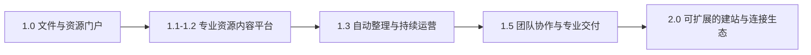
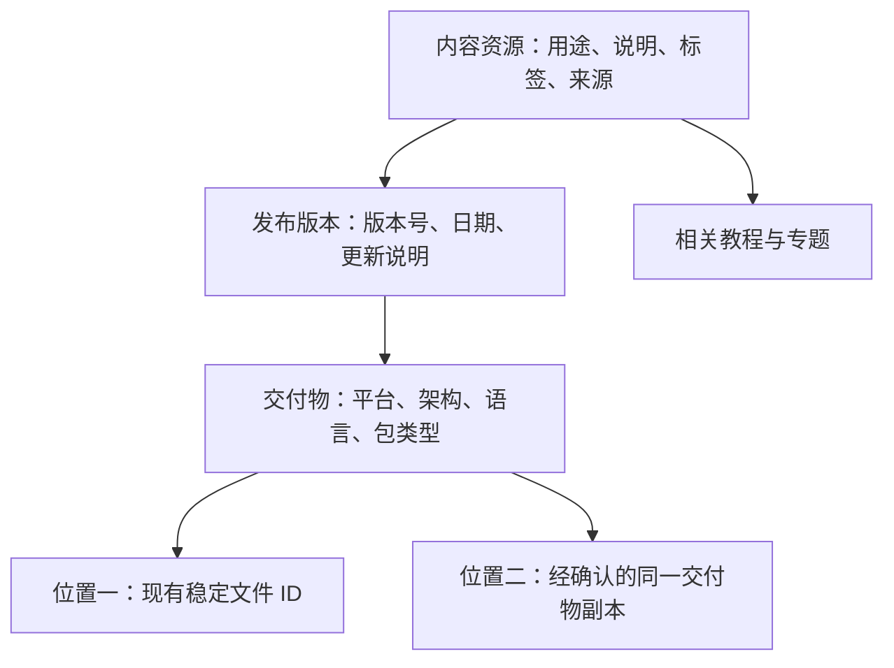

# CloudSite 未来蓝图

> 更新：2026-09-10  
> 当前基线：v1.0.0，提交 `c46a1d94c10d29ba0168f6c5988bc5ce75cdc69c`。  
> 本版结合当前源码审查，以及用户提供的《cloudsite未来规划蓝图.md》重新编排。重点是产品的未来形态、用户价值与成长路径。  
> 配套执行文档：[CloudSite未来产品开发手册.md](CloudSite未来产品开发手册.md)。所有未来版本、指标和商业方向均为建议，尚未上线。

## 一、我们要把 CloudSite 做成什么

**CloudSite 的长期方向：让任何内容维护者都能把自己的云盘、NAS 和对象存储，变成一个可以持续运营的专业资源网站。**

使用者不必理解网盘目录结构，也不必根据文件名猜版本和用途；维护者不必开发网站、重复填写相同资料、手动整理每一次更新。连接存储之后，CloudSite 负责理解、组织、呈现与维护资源，底层存储继续负责保存和交付文件。

产品演进应当体现为：



下一阶段最重要的变化，是把“一个文件就是一个资源”的模型，升级为“一个资源可以有说明、版本、不同平台的下载包、多个存储位置，以及相关教程”。这是后续搜索、自动整理、版本订阅、专业资源站和商业价值的共同基础。

例如，一个工具今天可能表现为散落在不同目录里的几个压缩包。未来应有一个完整资源页：用户先理解工具用途，再选择版本、平台和架构，阅读更新说明，找到对应教程，最后选择可用下载入口。维护者新增版本时，已有介绍、链接、关注关系和内容口碑可以延续。

## 二、当前 v1.0 已经给我们提供了什么

| 已有资产 | 能支撑的下一步 |
|---|---|
| AList 接入、内容根、滚动核验、稳定文件身份 | 持续发现文件变化，关联内容资源与下载位置 |
| 搜索、五类内容、目录浏览、预览与下载 | 升级为资源级发现、版本选择和内容消费 |
| 账户、收藏、历史、播放进度 | 升级为关注资源、跟踪更新、继续学习 |
| 合集、排序、封面、站点设置 | 升级为专题、任务资源包和场景化首页 |
| 分享、提取码、有效期和个人分享管理 | 升级为版本明确的交付包与项目交付入口 |
| 站内投稿、审核和通知 | 升级为发现、收录、审核、发布的内容生产流程 |
| 模块化后端、Provider 能力声明、双库、自动化交付 | 支撑增量演进与扩展契约 |

这些能力已经存在，不能再次用一个版本专门“从零建设”。参考蓝图中的 Beta→GA、后端从单文件拆分、初次建立 Provider 抽象等内容，需要按当前 v1.0 事实更新。

当前生产适配器是通用 AList。OpenList、S3、WebDAV、NAS 等是后续兼容验证或适配方向，不在本文件中冒充已验证支持。现有教程和 Office 预览继续保留；内部 `document`、`image` 等兼容类型继续使用。

当前产品更主要的价值缺口是：资源缺少说明和结构，版本/平台依赖文件名判断，内容发现主要依靠名称与路径，维护者缺少批量整理和持续运营工具，网站难以快速形成清晰的场景特色。

## 三、先赢得哪些用户

不把所有网盘用户都当作首批目标。优先选择内容价值明确、更新频繁、需要向他人发布资源的人群。

| 顺序 | 场景 | 用户真正需要的结果 | 最先提供的完整体验 |
|---|---|---|---|
| 第一主场景 | 软件与技术资源网站 | 找到合适工具，选对平台和版本，知道怎么使用 | 软件资源页、版本/平台选择、更新说明、配套教程、精选专题 |
| 第一阶段组合场景 | 教程与学习资源中心 | 围绕一个学习目标找到教程、视频和练习素材 | 任务型合集、前置知识、推荐顺序、继续播放和更新提醒 |
| 第二阶段 | 设计/摄影/品牌素材库 | 按主题和使用条件找到素材，交付一组正确文件 | 素材标签、预览、来源和使用说明、版本明确的资源包 |
| 第二阶段 | 客户项目交付 | 给客户一个清楚、稳定、有边界的交付页面 | 项目说明、交付清单、固定版本分享、到期与更新通知 |
| 后续专业场景 | 企业软件和资料中心 | 多人维护、统一发布、员工方便查找、过程可追溯 | 编辑审核角色、SSO、发布记录、专业部署与支持 |

首批选择 3–5 个真实试点，重点做“软件＋教程＋配套素材”的组合。五种内容类型使用共同资源内核，再用不同页面模板表达，不发展成五套互不相通的系统。

## 四、旗舰能力一：真正的资源中心

### 4.1 从文件页面升级为资源页面

未来资源应分成四层：



以虚构的“示例工具”为例：

| 层次 | 示例 |
|---|---|
| 资源 | 示例工具：做什么、适合谁、来源、使用方法 |
| 版本 | 2.4 稳定版、2.3 历史版，各有更新说明 |
| 交付物 | Windows x64 安装包、Windows ARM64 安装包、Linux 压缩包 |
| 存储位置 | AList 中的主位置，未来另一来源中的已确认副本 |

“不同平台的安装包”与“同一个包的多个镜像位置”必须区分。镜像故障可以切换同一交付物的可用位置，不能静默换成另一个版本或架构。

### 4.2 用户能直接感受到什么

- 一个资源有稳定的主页面，更新文件不会让介绍、收藏和分享关系全部重新开始。
- 支持按平台、架构、语言筛选下载项；默认选择有依据，也允许用户手动更改。
- 当前版本、历史版本、测试版本清晰分开。界面不能只按版本字符串大小猜“最新”。
- 安装说明、截图、来源、使用条件和关联教程帮助用户判断是否适用。
- 同一资源的下载位置失效时，可以展示经过验证的替代位置。
- 没有版本概念的图片、资料和通用文件，可以使用简单资源页面，不强迫用户填写软件字段。

### 4.3 第一版怎样落地

v1.1 先让管理员手动建立资源、添加版本、选择已索引文件作为下载资产。保留现有文件页和下载 URL，新资源页单独增加。先验证资源结构和使用体验，再让自动化替人减少整理工作。

不在第一版自动把同名文件合并，不改变已有文件 ID 的含义，不把旧文件收藏悄悄替换成“永远下载最新版本”。兼容方案放在开发手册中。

**价值验收**：用户能在一个页面找到所需平台和版本；维护者新增第二个版本时无需重复填写整个资源介绍；旧链接继续可用。

## 五、旗舰能力二：自动整理工作台

自动化应成为 CloudSite 的主要产品能力。最先解决维护者反复劳动的问题，而不是先增加聊天窗口。

### 5.1 一个维护者每天使用的工作台

```text
发现新文件或变更
→ 规则提取名称、版本、平台等候选信息
→ 判断是新资源、新版本、交付物还是疑似副本
→ 展示建议和依据
→ 管理员批量确认或修正
→ 发布资源与更新说明
→ 通知关注者
```

工作台优先提供四个队列：待整理、待确认版本、疑似重复、需要复核。每条建议可看到原文件、匹配依据、改动预览、置信程度和撤销入口。没有把握的项目留在队列，不自动发布。

### 5.2 规则先解决确定的问题，AI 补充难题

| 能力 | 初期方案 | 后续增强 |
|---|---|---|
| 文件名解析 | 规则识别扩展名、平台、架构、常见版本写法 | 可配置的站点解析规则 |
| 资源归组 | 已确认别名、来源、文件身份及明确匹配规则 | AI 给出候选归组，管理员确认 |
| 简介与标签 | 模板和已有可信元数据 | AI 生成草稿，保留来源和修改记录 |
| 重复识别 | 已有可靠校验值/身份信号形成候选 | 相似度辅助，不凭同名或大小自动合并 |
| 更新说明 | 差异清单与维护者填写 | 基于可引用材料形成摘要草稿 |
| 内容质量 | 缺少说明、失效入口、长期未复核等规则 | 按价值和风险排序维护队列 |

AI 为可选能力，支持本地或用户配置的服务。关闭 AI 后规则、手工整理和网站发布仍然完整可用。未授权时不发送私人文件正文给外部服务。规则/AI 生成结果与人工确认结果分层保存，便于重新生成、审核和撤销。

**价值验收**：以同一批 100 个样本文件，对比手工整理与工作台整理所需时间、修改次数和错误归并率。目标是减少至少 40% 的整理时间，同时确认错误合并为零；这是试点目标，不能宣传为当前能力。

## 六、旗舰能力三：面向任务的发现与持续使用

### 6.1 搜索对象从文件名扩展到资源

检索应覆盖资源标题、别名、标签、用途、版本和平台；目录路径作为辅助信号。默认继续利用 SQLite FTS，先通过评估决定字段权重，不在蓝图中把未经测试的分值当最终算法。

用户可搜索“适合某平台的工具”“某任务需要的教程与素材”，也能用准确文件名回到旧文件。搜索结果区分资源条目与具体文件，避免一个软件的十几个包挤满首屏。

搜索建议、别名和无结果反馈先行；纠错与语义检索在拥有真实查询样本后加入。后续可选搜索服务由容量与需求决定，默认部署继续简单。

### 6.2 专题与资源之间形成关系

现有合集发展为任务型专题：说明要完成什么、需要哪些准备、每个条目为什么有用，复用现有排序。可以组织“新设备工具清单”“某技能入门”“一套项目素材”。

软件条目关联教程，教程关联视频和练习文件，素材关联使用案例。第一步由维护者显式编排，后续再辅助推荐，避免一开始就建立庞大知识图谱。

### 6.3 用户回来的理由

- 关注一个资源或专题，接收新版本和重要内容更新。
- 从收藏、历史和播放进度继续使用，不重复建设这些已有模块。
- 查看“你关注的资源更新了什么”，支持合并通知和退订。
- 在资源页反馈链接失效或说明错误，并看到处理结果。
- 对固定版本需求提供明确入口，不自动改成最新版本。

**价值验收**：查找任务成功率、选错下载项的比例、发布后的回访、反馈处理时间和专题使用率改善；不以单纯 PV 增长替代用户是否用上资源。

## 七、旗舰能力四：几步搭起专业资源网站

用户购买或采用的通常是一个可用的网站体验，而不是一组后台模块。CloudSite 应降低从“部署成功”到“网站可发布”的距离。

### 7.1 场景预设

| 预设 | 首页重点 | 详情页重点 |
|---|---|---|
| 软件资源网站 | 精选资源、分类、新版发布、实用专题 | 说明、平台/版本、更新记录、下载与教程 |
| 教程中心 | 学习主题、入门路径、最近更新 | 适用对象、前置知识、内容和练习文件 |
| 素材库 | 标签、主题、预览、精选素材包 | 预览、规格、来源、使用条件 |
| 客户交付 | 项目说明、交付清单、最新交付状态 | 固定版本、文件清单、到期和反馈 |

第一阶段先提供软件和教程两种预设，底层能力复用。预设只改变首页区块、字段展示和组织方式，不创建另一套数据库或权限系统。

### 7.2 建站流程

连接存储 → 选择发布范围 → 选择场景预设 → 整理首批资源 → 设置名称/品牌 → 预览手机与桌面 → 确认发布。

提供经过授权的示例内容和可重置演示站，帮助新用户在真实数据接入前理解产品。管理后台应能配置首页区块、精选内容和排序，不要求改源码。

主题系统分两步：先稳定设计变量、区块配置和资源卡模板，再形成可发布的主题包。不要一开始做任意代码插件和复杂拖拽页面编辑器。

### 7.3 站外发现与品牌表达

需要公开传播的站点，由管理员主动选择公开资源说明页或专题页，提供独立标题、摘要、分享卡和站点地图。默认受保护的门户维持原访问方式；公开介绍不自动等于允许匿名下载。

未来可以增加自定义域名配置指引、更多页面预设和可导出主题配置。现阶段不需要原生 App，先把移动网页、安装式网页体验和主要任务做完整。

**价值验收**：首次用户能在无需改源码的情况下发布一组有明确场景的资源页面；5 个试装中至少 4 个完成设置，首批小样本从配置到可用页面的中位耗时目标 ≤30 分钟。大库完整扫描耗时单列。

## 八、旗舰能力五：持续运营与专业交付

### 8.1 维护者需要的是行动线索

运营台先回答：用户在找什么、哪里找不到、哪些资源值得补说明、哪些下载入口失效、哪些旧版本应复核、哪些专题真正被使用。

已有数量、日志和下载事件继续利用，新增无结果搜索、资源级使用、版本选择和内容完整度。把问题变成可处理的队列，并能跳到对应内容编辑或复核操作。

“热门”必须有真实口径或明确人工精选；不能再把文件大小当热度。下载事件只能证明 302 入口签发，不能声称文件传输完成。

### 8.2 客户交付包

在已有合集和分享上扩展项目说明、固定版本清单与交付记录。客户打开链接后知道本次交付包含什么、使用哪个版本、哪些文件更新过。

区分两种交付模式：固定清单保留当时选定的版本与交付项；持续更新入口明确跟随资源更新。固定 ID 不代表文件内容永远不变：如需冻结交付内容，必须绑定上游不可变版本或可靠内容指纹，检测到变化后停止按旧资产交付并提示复核。来源不具备这类能力时，只承诺固定清单。现有分享默认保持原语义。客户确认阅读或收到交付清单可作为新事件，但不能等同于所有文件下载完成。

### 8.3 小团队协作

当多人维护需求出现，先做编辑、审核、发布和操作记录，让不同人员在同一资源生产流程中协作。随后再接入企业登录和更细的范围授权。

优先解决“谁能整理、谁能发布、谁能看到结果”，不把组织架构、复杂文件 ACL 和多租户 SaaS 一次做全。

## 九、开放平台与生态怎样成长

### 9.1 多来源，让 CloudSite 不被某一个存储产品定义

已有 AList Provider 是起点。先建立支持版本与能力矩阵，验证 OpenList 的实际兼容性；再选择需求最明确的 S3、WebDAV 或本地/NAS 接入方向实现一个适配器。

多来源的目标包括统一资源呈现、不同位置的同一交付物、来源迁移后内容页面不变。实施前必须引入来源命名空间，避免路径相同被当作同一文件。

本地文件或某些 Provider 未必能提供原生浏览器下载地址。适配器必须声明 list/stat/download/preview/identity/sync 能力；无原生交付能力时明确依赖外部网关或不提供下载，不能暗中把 Core 改成通用代理。

### 9.2 先有集成契约，再有插件市场

按三步发展：

1. 稳定内容、版本、资产与事件 API，提供最小导入工具和示例脚本。
2. 增加范围受限的 API Token、Webhook 与规则动作，让外部工具能提交候选资源、更新资料或接收发布事件。
3. 形成 Provider、元数据解析器、主题和自动化动作的扩展契约；有真实第三方扩展后再建设目录或市场。

扩展包声明兼容版本和权限，失败不破坏核心浏览与下载。初期选择窄接口和隔离任务执行，不开放任意插件直接修改所有数据库表。

### 9.3 开源采用与贡献

开源增长也是产品工作：README 用真实场景解释价值，提供可重置演示、短视频、示例资源库、安装排障和明确路线图。建立贡献说明、问题/PR 模板、模块负责人和公开需求讨论流程。

第一批社区贡献应容易开始：主题预设、文件名解析规则、Provider 兼容测试、翻译、教程和示例集成。贡献者不需要先理解整套权限和同步系统。

衡量真实安装、持续使用、有效问题反馈和外部贡献完成时间；Star 数可观察，但不作为产品价值的唯一依据。

## 十、商业路径：为节省时间和专业交付收费

当前 MIT 许可保持不变。下面是商业模式实验，不是已发布的套餐、收费墙或许可调整决定。

| 路线 | 客户愿意付费的结果 | 最低成本验证 |
|---|---|---|
| 安装与托管维护服务 | 无需自己处理安装、升级、备份和故障 | 为少量试点提供有明确范围的付费服务，计算真实支持工时 |
| 专业内容整理 | 旧目录快速变成可运营资源库 | 交付批量归组、版本整理、内容导入与模板配置 |
| 品牌与交付方案 | 快速上线符合品牌的资源站或客户交付门户 | 付费主题配置、场景方案、迁移与培训 |
| 团队/企业方案 | 多维护者、统一登录、可追溯发布和支持响应 | 与实际团队共创，再定义支持与功能组合 |
| 托管 CloudSite | 用户连接自己的来源，无需运维应用 | 在有重复需求、清晰成本与隔离方案后小范围试运行 |

基础安全修复、数据可导出和可信备份不应依赖付费资格。是否建设独立 Pro 产品、哪些增强模块如何授权，需在需求和贡献治理明确后另行决策，不预先把 PostgreSQL、RBAC 等技术名词直接画成收费边界。

先验证服务和专业交付的付费意愿，再开发账单、订阅和多租户控制面。没有实际客户数据时，不给出市场规模和收入预测。

## 十一、版本与时间路线

以两名熟悉项目的工程师、兼职产品/内容维护者为参考。时间是条件性窗口，按阶段验收推进；安全/恢复修复独立走维护线，不把整个产品版本变成审计版本。

| 阶段 | 建议版本/窗口 | 用户看得见的成果 | 完成条件 |
|---|---|---|---|
| 维护线 | v1.0.x，立即启动并持续 | 现有功能行为可信、安装和恢复可用 | 手册中的关键缺陷逐项修复并回归，不扩大风险 |
| 资源化 | v1.1，约第 1–3 个月 | 资源主页面、手工版本/资产绑定、说明标签、全类型发现、真实投稿收录 | 首批 50 个资源、至少 10 个多版本/多平台案例，用户可正确选包，旧链接兼容 |
| 网站化 | v1.2，约第 3–5 个月 | 资源级搜索、软件/教程预设、首页区块、专题与版本关注、内容导入导出 | 至少 3 个试点能独立维护，典型检索与建站时间改善 |
| 自动运营 | v1.3，约第 5–8 个月 | 批量整理工作台、规则解析、AI 草稿可选、版本/副本候选、质量待办 | 对照样本显著降低整理时间，无错误自动合并，操作可撤销 |
| 专业协作 | v1.5 候选，约第 8–12 个月 | 编辑审核、专业交付包、企业登录试点、需求明确的新来源 | 有真实团队和第二来源需求；部署成本与默认体验可控 |
| 平台生态 | v2.0，12 个月后按需求 | 稳定扩展接口、主题/适配器贡献、自动化集成，评估多站点/托管 | 至少两个外部维护的扩展或集成、稳定契约与持续维护能力 |

这些窗口不是保证；单人/兼职团队按实际投入顺延。v1.1 不必等整个多版本体验成熟才展示价值：先交付资源卡和最小绑定，再补版本选择。无需等到 v1.3 才开始规则解析实验，提前在影子模式生成候选即可。

### 11.1 前 90 天应交付的具体东西

- **第 1–2 周**：确认一个主要场景，建立资源/版本/资产术语和样本；并行修复关键缺陷，准备真实试点。
- **第 3–6 周**：资源主页面、人工内容与文件绑定；导入首批样本，保留旧文件页和分享；维护者能实际编辑与发布。
- **第 7–10 周**：版本/平台选择、资源级搜索最小版、精选专题与投稿成果链接；对比用户选包和检索任务。
- **第 11–12 周**：内容导出恢复、软件/教程预设试用、演示材料、访谈复盘；用解析规则离线试验评估后续自动整理投入。

若维护线风险影响内容资产保存，暂缓相关功能推广；访谈、样本整理、页面原型、规则实验和内容设计仍可并行，不需要所有产品工作停摆。

## 十二、如何判断产品真的更有价值

当前没有经过核验的生产业务基线。以下目标用于试点，先采集基线、再设最终门槛。小样本同时提供任务记录和访谈，不包装成市场结论。

| 要验证的价值 | 指标口径 | 初始试点目标 |
|---|---|---|
| 选对版本与平台 | 在固定任务下正确选择交付物的任务数 / 全部选包任务 | 至少 20 个任务，正确率 ≥95%，并记录耗时 |
| 维护更省时间 | 同一批样本从发现到可发布所需人工分钟数 | 自动整理试点相比手工基线减少 ≥40%，同时零确认错误合并 |
| 搜索更有用 | 存在合适且有权访问资源的正例中，前 5 个结果命中的比例 | 至少 50 条正负例查询，正例较基线提升 ≥15 个百分点；高基线时以不回退且更快为目标 |
| 找不到的问题可被解决 | 零结果查询占比、转为内容待办并解决的数量 | 先观察两周，再选择前 10 类缺口治理 |
| 网站更快建成 | 环境/存储就绪到首批资源页面可使用的时间 | 5 个试装中至少 4 个无需改源码，小样本中位 ≤30 分钟 |
| 内容可以持续维护 | 首批精选资源的说明、来源、标签、审核时间覆盖率 | ≥90%；不强求全库一次性填写 |
| 发布有成果 | 已批准投稿中，14 天内绑定可用资源的数量 / 当周批准数量 | ≥80%，未完成原因单列 |
| 用户愿意回来 | 首次有效使用后第 1–7 天再次有效使用的人数 / 同期首次有效使用人数 | 先建 cohort 和样本数，不预设漂亮百分比 |
| 专业服务可持续 | 每个试点节省时间、愿付费结果、实际支持成本 | 先获得重复需求，再定义套餐 |

有效使用分别统计预览实际开始、下载入口签发、收藏、继续播放和资源更新访问。302 不代表文件传输完成。查询负例单独评估正确空结果和零越权暴露；不能把无正确答案的查询放进正例命中率分母。

统计默认实例内、最小采集、可关闭、有保留期。运营能力为维护者服务，不默认建立跨站用户追踪。

## 十三、架构怎样支持这份愿景

1. **增加内容资源域，不重命名旧文件域。** 当前 `Resource` 和稳定 `resource_id` 继续代表文件对象；新内容条目、版本、交付物和位置关系进入 `state.db`。
2. **人工内容是核心资产。** 介绍、标签、归组、版本关系、审核和主题配置纳入备份与导出；同步只更新文件事实。
3. **新体验增量接入。** 资源主页面与新 API 使用独立入口，旧文件页、下载、收藏、历史和分享保持原语义。
4. **默认部署保持轻量。** SQLite、Compose 和单实例继续支持；额外数据库、缓存、执行进程由实际负载触发。
5. **任务与自动化可重试。** 候选生成、审核发布、索引投影、通知有明确状态、幂等和版本；失败可以恢复而非从头猜测。
6. **扩展按能力契约加入。** Provider、解析器、主题、通知动作分别演进；没有明确能力时不承诺实时同步或原生下载。
7. **按场景组合共用能力。** 软件、教程、素材、客户交付使用共同资源与资产模型，避免分裂为互不兼容的产品。

现有 `/d` 和 `/p` 保持 302。文本读取与 PDF/Office 的受限缓存是现行预览例外，保持大小、时间、类型和访问边界；不把“轻量”误写成任何内容都不经过应用。

## 十四、当前问题怎样安排，避免挤占产品主线

本次审查发现的管理员资格与会话撤销、备份遗漏及验证误报、下架元数据旁路、构建一致性问题，仍需认真修复。它们进入独立维护线，详细证据、测试和回滚集中放在开发手册。

产品线同步修正三个直接影响使用的现状：热门按文件大小排序、全类型入口误指向 file 分类、投稿已发布未绑定实际资源。随后把主要新增投入用于资源模型、版本交付、建站预设、发现和自动整理。

本次现有测试为后端 355 passed、前端 19 passed；上述重要异常仍能在隔离环境复现，说明通过现有测试不能替代目标行为验证。未访问真实凭据或修改生产，本文件不声称生产已发生数据丢失或被利用。

## 十五、参考蓝图的吸收与调整

| 参考方向 | 本版处理 |
|---|---|
| Storage → Content → Website | 作为长期产品主线，明确用户和场景 |
| Resource 与 File 解耦 | 提升为下一阶段首要模型，区分版本、交付物与物理副本 |
| AI 整理与自动治理 | 提升为核心产品能力，规则先行、AI 可选、人工确认、可撤销 |
| 多 Provider、主题、API、插件 | 纳入平台路线，按可交付契约逐步建设 |
| 企业、Pro、Cloud | 保留商业空间，以付费结果和成本验证决定产品形态 |
| 从 Beta 做 GA、再次拆后端 | 当前已有基础，转为必要的维护工作，不重复占用整个版本 |
| 一年内全面上 PostgreSQL/Redis/企业能力 | 改为条件触发，保留轻量默认安装 |
| 无边界自动理解与自动发布 | 改为明确支持范围、候选建议与管理员发布，避免无法兑现的承诺 |

参考文件：用户提供的 `C:/Users/Nathan/Desktop/1.0rc.1/cloudsite未来规划蓝图.md`，作为产品方向材料使用，未将其中旧版本待办或操作语句当成本次执行指令。

邻近产品提供的启示：Nextcloud 的文件协作方向、Immich 的内容检索能力、Jellyfin 的媒体处理方向，各自有明确主场景。CloudSite 的选择是围绕资源建站与持续运营形成完整体验，而非同时承担这些产品的全部范围。相关官方资料核对于 2026-09-10：[Nextcloud Files](https://nextcloud.com/files/)、[Immich 搜索](https://docs.immich.app/features/searching/)、[Jellyfin 转码](https://jellyfin.org/docs/general/post-install/transcoding/)。

**CloudSite 最值得积累的长期资产，是稳定的资源关系、经过整理的内容、可重复的发布流程，以及帮助用户节省维护时间的自动化能力。下一版就应让这些价值出现在真实页面和真实操作中。**
