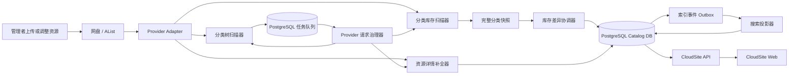
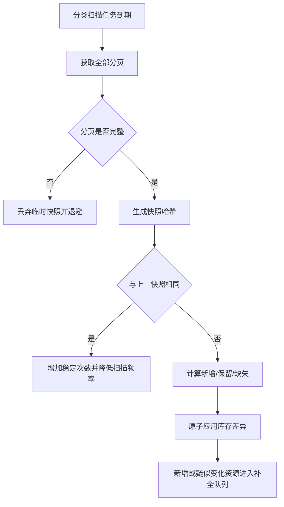

# CloudSite 新索引架构开发文档

> 文档版本：2.0-draft  
> 编制日期：2026-09-10  
> 适用范围：CloudSite 2.0 索引、同步、资源目录与搜索系统  
> 目标容量：首期 20,000 个资源，设计余量 100,000 个资源

---

## 1. 文档目的

本方案放弃 CloudSite 1.0 以“递归遍历全部目录、按目录滚动复查”为核心的索引架构，重新建立面向以下真实目录模型的新索引系统：

```text
内容根目录
└── 资源大类
    └── 资源子类
        └── 资源文件夹（一个资源一个文件夹）
            ├── 主文件
            ├── 说明文件
            ├── 封面或截图
            └── 可选资源清单
```

首期数据规模约为：

```text
资源总数：20,000+
资源文件夹：20,000+
分类目录：几十至数百个
资源规则：一个资源对应一个独立文件夹
```

新架构的重点不是让系统更快地递归扫描 20,000 个资源文件夹，而是彻底避免日常扫描进入全部资源文件夹。

核心目标是：

> 通过“分类库存索引 + 资源详情按需补全 + 聚合清单优先”的方式，把常规远端请求量从与资源总数线性相关，降低到与分类目录数量和实际变更数量相关。

---

## 2. 核心设计结论

新索引架构采用以下原则：

1. **资源对象是文件夹，不是文件。**
2. **非叶子分类目录只允许包含分类；叶子分类目录只允许包含资源文件夹。**
3. **日常库存扫描只列出叶子分类目录的直接子目录，不进入全部资源文件夹。**
4. **资源首次出现时先生成可搜索的资源骨架，再异步补全详情。**
5. **资源详情优先从资源清单或分类聚合清单读取，不依赖递归扫描。**
6. **只有新增、疑似变化、用户主动提交或超过验证期限的资源才进入详情扫描队列。**
7. **取消固定四窗口和“任务多就自动加速”的调度方式。**
8. **所有自动、手动、恢复任务共享同一个上游账号请求预算。**
9. **分类扫描必须形成完整快照，分页不完整时正式索引零写入。**
10. **普通用户浏览、搜索和翻页全部读取本地索引，不实时访问网盘。**

---

## 3. 目标与非目标

### 3.1 建设目标

新架构必须满足：

- 支持至少 20,000 个资源文件夹；
- 支持几十至数百个叶子分类；
- 常规分类巡检不进入 20,000 个资源文件夹；
- 新增一批资源后，只处理对应分类和新增资源；
- 网盘短暂异常、分页缺失、返回空列表时不得误删资源；
- 服务重启后任务可以继续执行；
- 同一网盘账号始终受到统一限速、预算和熔断约束；
- 索引数据库可以完全重建；
- 业务数据、用户数据、合集和分享不因索引重建而丢失；
- 20,000 条资源搜索、筛选和分页保持稳定；
- 为后续 100,000 个资源预留扩展空间。

### 3.2 非目标

本阶段不负责：

- 代替网盘保存文件；
- 为大文件提供中转传输；
- 绕过网盘平台的访问规则或风险控制；
- 自动转码视频；
- 对全部文件计算内容哈希；
- 实时监听所有第三方网盘底层变更；
- 在一次任务中完成 20,000 个资源文件夹的深度读取。

---

## 4. 标准目录规范

### 4.1 推荐目录结构

```text
/CloudSite
├── 软件
│   ├── 系统工具
│   │   ├── GeekUninstaller
│   │   │   ├── GeekUninstaller.exe
│   │   │   ├── README.md
│   │   │   ├── cover.webp
│   │   │   └── _cloudsite.resource.json
│   │   ├── 7-Zip
│   │   │   ├── 7z-x64.exe
│   │   │   ├── 7z-x86.exe
│   │   │   └── _cloudsite.resource.json
│   │   └── _cloudsite.catalog.json
│   ├── 办公软件
│   └── 网络工具
├── 图片
│   ├── 壁纸
│   ├── 摄影
│   └── 素材
├── 视频
│   ├── 教程
│   ├── 纪录片
│   └── 素材
└── 文档
    ├── 技术资料
    └── 模板
```

### 4.2 强制目录规则

#### 分类目录

- 内容根以下允许存在多级分类；
- 建议分类深度不超过 4 层；
- 非叶子分类目录只能包含分类目录；
- 叶子分类目录只能包含资源文件夹和 CloudSite 保留文件；
- 不允许同一目录同时混放子分类和资源文件夹。

#### 资源文件夹

- 一个资源只能对应一个资源文件夹；
- 资源文件夹是 CloudSite 的最小资源单元；
- 资源文件夹名称在同一分类下必须唯一；
- 资源文件夹内部可以包含多个下载文件、说明、封面和截图；
- 资源文件夹内部默认不继续识别为新的 CloudSite 资源；
- 资源文件夹内部建议不超过 200 个直接条目；
- 复杂资源必须通过清单声明主要文件，避免递归遍历。

### 4.3 保留文件名

以下名称由 CloudSite 使用，不在前台作为普通资源文件展示：

```text
_cloudsite.category.json
_cloudsite.catalog.json
_cloudsite.resource.json
_cloudsite.ignore
```

---

## 5. 资源清单规范

### 5.1 单资源清单

每个资源文件夹可放置：

```text
_cloudsite.resource.json
```

推荐格式：

```json
{
  "schema": 2,
  "id": "01993f31-bc96-7d4c-a94a-b415afef206a",
  "title": "Geek Uninstaller",
  "version": "1.5.4.180",
  "summary": "轻量级 Windows 软件卸载与残留清理工具",
  "tags": ["卸载", "清理", "Windows"],
  "platforms": ["windows"],
  "architectures": ["x64", "x86"],
  "license": "freeware",
  "official_url": "",
  "cover": "cover.webp",
  "updated_at": "2026-09-10T12:00:00Z",
  "files": [
    {
      "path": "GeekUninstaller.exe",
      "label": "Windows 主程序",
      "role": "primary",
      "size": 7569408,
      "sha256": ""
    }
  ]
}
```

### 5.2 稳定资源 ID

资源 ID 优先级：

1. `_cloudsite.resource.json` 中的 UUID；
2. Provider 返回的稳定对象 ID；
3. CloudSite 首次发现时生成的本地 UUID；
4. 无稳定标识时，移动或重命名只能做尽力匹配。

建议通过资源清单保存稳定 UUID。这样资源移动、改名或分类调整后，收藏、合集、分享和历史记录仍可继续关联。

### 5.3 分类聚合清单

每个叶子分类可放置：

```text
_cloudsite.catalog.json
```

该文件是本分类所有资源清单的聚合投影，由本地构建工具生成。示例：

```json
{
  "schema": 2,
  "category": "软件/系统工具",
  "generation": "2026-09-10T12:00:00Z",
  "resource_count": 380,
  "digest": "sha256:...",
  "resources": [
    {
      "id": "01993f31-bc96-7d4c-a94a-b415afef206a",
      "folder": "GeekUninstaller",
      "title": "Geek Uninstaller",
      "version": "1.5.4.180",
      "summary": "轻量级 Windows 软件卸载与残留清理工具",
      "tags": ["卸载", "清理", "Windows"],
      "cover": "cover.webp",
      "updated_at": "2026-09-10T12:00:00Z",
      "manifest_digest": "sha256:...",
      "files": [
        {
          "path": "GeekUninstaller.exe",
          "label": "Windows 主程序",
          "role": "primary",
          "size": 7569408
        }
      ]
    }
  ]
}
```

分类聚合清单不是唯一真相来源，而是高效率索引入口：

- 聚合清单存在且通过校验时，不需要逐个进入资源文件夹；
- 聚合清单缺失时，系统仍可通过目录库存建立资源骨架；
- 聚合清单与真实目录不一致时，以目录存在性为准，并标记清单需要重建；
- 上传批次时，聚合清单必须最后上传，作为本批资源已经完成的提交标记。

---

## 6. 新索引分层

新索引拆分为五层。

### L0：分类树索引

保存：

- 内容根；
- 分类父子关系；
- 分类路径；
- 是否为叶子分类；
- 分类状态；
- 分类扫描策略。

分类数量远小于资源数量，可以低频完整验证。

### L1：资源库存索引

资源库存只来源于叶子分类的直接子目录列表。

每个直接子目录创建一个资源骨架：

```text
resource_id
category_id
provider_folder_path
folder_name
title（初始等于文件夹名）
metadata_state=stub
status=active
first_seen_at
last_seen_at
```

库存扫描不进入资源文件夹，因此 20,000 个资源不会产生 20,000 次日常目录请求。

### L2：资源详情索引

保存：

- 正式标题；
- 版本；
- 简介；
- 标签；
- 平台；
- 架构；
- 封面；
- 授权方式；
- 官方链接；
- 清单版本；
- 清单摘要。

详情来源顺序：

```text
分类聚合清单
→ 单资源清单
→ 文件夹名称与文件自动推断
→ 管理后台人工补充
```

### L3：资源文件索引

保存资源文件夹内可下载文件：

```text
文件相对路径
显示名称
大小
MIME
角色
版本
架构
校验值
可用状态
```

具备聚合清单时直接导入；没有清单时才进入资源文件夹读取。

### L4：搜索投影

搜索索引只从本地数据库构建，不实时请求网盘。

搜索文档包含：

```text
标题
文件夹名
别名
版本
标签
分类路径
平台
架构
简介
拼音全拼
拼音首字母
中文二元词片段
热度
更新时间
```

---

## 7. 总体系统架构



### 7.1 服务拆分

CloudSite 2.0 至少包含：

```text
cloudsite-web       前端展示
cloudsite-api       对外与管理接口，不执行长时间扫描
cloudsite-indexer   后台索引 Worker
postgres            业务、索引、队列与搜索数据
alist               外部存储访问层
```

索引任务不得继续运行在 FastAPI 生命周期任务中。API 重启不应中断后台索引，Indexer 也可以独立升级和恢复。

### 7.2 不引入 Redis 的首期方案

20,000 至 100,000 个资源阶段，任务队列直接使用 PostgreSQL：

```sql
SELECT ...
FROM index_jobs
WHERE status = 'pending'
  AND due_at <= now()
ORDER BY priority DESC, due_at ASC
FOR UPDATE SKIP LOCKED
LIMIT 1;
```

优点：

- 少一个必须维护的组件；
- 任务状态和索引事务一致；
- 重启后天然恢复；
- 支持多个 Worker，但同一上游账号仍可限制为单并发。

当任务量或多节点规模超过 PostgreSQL 队列能力后，再引入 Redis，不作为 2.0 首发依赖。

---

## 8. 核心数据模型

### 8.1 Provider 与内容根

#### `providers`

```text
id
name
type
base_url
credential_group_id
capabilities_json
status
last_success_at
blocked_until
created_at
updated_at
```

#### `content_roots`

```text
id
provider_id
root_path
display_name
category_max_depth
leaf_detection_mode
enabled
created_at
updated_at
```

### 8.2 分类模型

#### `categories`

```text
id UUID
content_root_id
parent_id
provider_path
name
depth
is_leaf
status
inventory_tier
last_snapshot_hash
last_scanned_at
last_changed_at
next_scan_at
unchanged_streak
error_streak
created_at
updated_at
```

### 8.3 资源模型

#### `resources`

```text
id UUID
category_id
provider_id
provider_folder_path
provider_object_id
folder_name
title
slug
version
summary
cover_path
metadata_state        stub / hydrated / stale / error
manifest_schema
manifest_digest
folder_modified_at
status                active / suspected_missing / tombstone / disabled
first_seen_at
last_seen_at
last_hydrated_at
next_verify_at
missing_streak
created_at
updated_at
```

#### `resource_metadata`

```text
resource_id
platforms JSONB
architectures JSONB
tags JSONB
aliases JSONB
license
official_url
extra JSONB
updated_at
```

#### `resource_files`

```text
id UUID
resource_id
relative_path
name
display_name
role
size
mime_type
sha256
provider_object_id
status
first_seen_at
last_seen_at
updated_at
```

### 8.4 快照模型

#### `category_snapshots`

```text
id UUID
category_id
status                collecting / complete / invalid / applied
page_size
pages_expected
pages_received
entries_expected
entries_received
snapshot_hash
started_at
completed_at
error_code
error_message
```

#### `category_snapshot_entries`

```text
snapshot_id
entry_key
name
provider_path
provider_object_id
modified_at
size
is_directory
metadata_digest
```

只保留最近 2 至 3 份完整快照。无效和超期临时快照定期清理。

### 8.5 任务队列

#### `index_jobs`

```text
id UUID
job_type
scope_type
scope_id
provider_id
credential_group_id
priority
reason
budget_class
due_at
status
attempts
max_attempts
dedupe_key
lease_owner
lease_until
blocked_until
last_error_code
last_error_message
created_at
updated_at
```

`dedupe_key` 必须唯一，确保同一分类或资源的重复事件自动合并。

### 8.6 请求预算

#### `provider_budget_state`

```text
credential_group_id
max_concurrency
min_interval_ms
hourly_limit
daily_limit
refresh_hourly_limit
refresh_daily_limit
hourly_used
daily_used
refresh_hourly_used
refresh_daily_used
last_request_at
blocked_until
limit_level
consecutive_errors
updated_at
```

### 8.7 索引事件

#### `catalog_outbox`

```text
id
aggregate_type
aggregate_id
event_type
payload_json
status
created_at
processed_at
```

库存或详情事务提交时同步写入 Outbox，搜索投影和缓存失效由后台消费，避免数据库已更新但搜索仍未同步。

---

## 9. 分类识别规则

支持三种叶子分类识别方式。

### 9.1 显式配置模式

管理员在后台指定哪些目录是叶子分类。稳定性最高，适合正式部署。

### 9.2 标记文件模式

叶子分类中放置：

```text
_cloudsite.category.json
```

示例：

```json
{
  "schema": 2,
  "type": "resource_container",
  "display_name": "系统工具"
}
```

### 9.3 固定深度模式

内容根配置：

```text
resource_folder_depth = 3
```

表示内容根以下第 3 层目录为资源文件夹，其父目录为叶子分类。

正式环境优先使用“显式配置 + 标记文件”，固定深度仅作为快速导入模式。

---

## 10. 初次索引流程

### 10.1 阶段一：建立分类树

```text
扫描内容根
→ 发现分类目录
→ 到达显式叶子分类后停止向下识别分类
→ 保存分类树
```

分类扫描只遍历分类层，不进入资源文件夹。

### 10.2 阶段二：建立资源库存

对每个叶子分类执行分页列表：

```text
page=1, per_page=500
page=2, per_page=500
……
直到完整结束
```

规则：

- 只接收直接子目录作为资源；
- 普通文件只允许是 CloudSite 保留文件；
- 所有分页完成后生成分类快照；
- 快照完整性通过后一次性写入资源骨架；
- 分页中任何一页失败时，旧索引保持不变。

20,000 个资源的初次库存请求量约为：

```text
分类目录列表请求
+ 每个叶子分类的分页请求
```

而不是 20,000 次资源文件夹请求。

### 10.3 阶段三：导入聚合清单

如果叶子分类存在 `_cloudsite.catalog.json`：

```text
验证 schema
→ 验证资源数
→ 验证目录资源是否存在
→ 验证 digest
→ 批量写入详情和文件索引
```

具备聚合清单时，初次索引可以在不进入每个资源文件夹的情况下完成完整元数据导入。

### 10.4 阶段四：后台补全

没有聚合清单的资源：

```text
先以 stub 状态上线
→ 按优先级进入 hydration 队列
→ 安全限速读取资源文件夹
→ 读取单资源清单或推断文件
→ 更新详情和搜索
```

补全顺序：

1. 最近新增；
2. 首页精选；
3. 用户请求查看但尚未补全；
4. 有封面或清单提示的资源；
5. 其他冷资源。

初次补全不需要阻塞网站上线。

---

## 11. 增量同步流程

### 11.1 分类库存扫描

分类是日常同步的主要扫描单元。



### 11.2 新增资源

当分类快照发现新资源文件夹：

```text
立即创建资源 stub
→ 设置 active
→ 进入高优先级 hydration
→ 搜索索引立即可搜到文件夹名称
```

如果聚合清单包含该资源，则直接变为 `hydrated`，无需进入资源目录。

### 11.3 更新资源

出现以下任一条件时，资源进入补全队列：

- 分类聚合清单 generation 变化；
- 资源 manifest_digest 变化；
- Provider 返回的资源文件夹 modified_at 变化；
- Provider 稳定对象版本变化；
- 管理员提交资源变化提示；
- 资源超过详情验证期限；
- 用户访问尚未补全的资源详情。

### 11.4 删除资源

删除不得依据一次异常返回直接生效。

```text
完整快照 A 未发现资源
→ active 改为 suspected_missing
→ 保留前台可见或进入待确认状态

至少间隔 6 小时后的完整快照 B 仍未发现
→ status 改为 tombstone
→ 从普通搜索隐藏
→ 保留资源 ID、合集和历史关系
```

下列情况不得推进删除状态：

- 分页不完整；
- 请求被限流；
- Provider 返回异常空列表；
- 分类快照触发大规模变化保护；
- 认证失败；
- 同一临时快照重复执行。

### 11.5 移动与重命名

处理优先级：

1. 清单 UUID 相同：直接更新分类和路径；
2. Provider 稳定对象 ID 相同：直接更新路径；
3. manifest_digest 唯一匹配：进入候选确认；
4. 仅名称或大小相似：不自动合并；
5. 无稳定证据：旧资源待删除，新资源按新增处理。

系统必须宁可产生新资源，也不能把两个不同资源错误合并。

---

## 12. 资源详情补全策略

### 12.1 Manifest-first

补全顺序：

```text
分类聚合清单
→ 单资源清单
→ 资源文件夹直接列表
→ 管理后台人工数据
```

### 12.2 无清单资源

无清单时：

- 只列出资源文件夹的直接条目；
- 默认不递归子目录；
- 自动识别常见主文件；
- 如果存在多个可下载文件，全部作为变体展示；
- 内部子目录超过上限时标记 `manual_manifest_required`；
- 不因无法识别主文件而删除资源。

### 12.3 详情验证周期

建议默认：

| 资源状态 | 下一次验证 |
|---|---:|
| 刚新增或刚更新 | 24 小时 |
| 7 天内有变化 | 7 天 |
| 已有稳定清单 | 30 至 90 天 |
| 无清单资源 | 14 至 30 天 |
| 用户访问且数据过期 | 提升为高优先级 |
| 疑似缺失 | 6 至 12 小时 |

资源详情验证可以延期，不得因队列积压自动突破 Provider 请求预算。

---

## 13. 新调度架构

### 13.1 取消固定滚动窗口

CloudSite 1.0 的“24 小时周期 + 固定窗口”不再使用。

2.0 使用持续任务队列：

```text
任务有 due_at
Worker 持续获取到期任务
请求治理器批准后执行
执行结果决定下一次 due_at
```

“窗口”只用于请求预算统计，不用于强制完成任务数量。

### 13.2 任务类型

| 优先级 | 任务类型 | 说明 |
|---:|---|---|
| 100 | `category_hint_scan` | 管理员确认某分类刚上传完成 |
| 95 | `missing_confirm` | 确认疑似缺失资源 |
| 90 | `new_resource_hydrate` | 补全新资源 |
| 80 | `resource_view_hydrate` | 用户访问未补全资源 |
| 70 | `catalog_refresh` | 分类聚合清单变化 |
| 60 | `hot_category_scan` | 最近频繁变化分类 |
| 40 | `warm_category_scan` | 普通分类巡检 |
| 20 | `cold_category_scan` | 长期稳定分类 |
| 10 | `integrity_verify` | 低速完整性兜底 |

任务优先级必须叠加等待时间，防止冷任务永久饥饿。

### 13.3 分类冷热分层

| 分类状态 | 建议巡检频率 |
|---|---:|
| 刚提交上传完成提示 | 防抖后立即 |
| 最近 24 小时有变化 | 1 至 3 小时 |
| 最近 7 天有变化 | 6 小时 |
| 连续稳定 7 天 | 24 小时 |
| 连续稳定 30 天 | 72 小时 |
| 归档分类 | 7 天 |

变化后自动升温，连续无变化后逐级降温。

### 13.4 稳定铺开

升级或首次创建任务时，不能让全部分类同时到期。

```python
offset = stable_hash(category_id) % spread_window_seconds
next_scan_at = migration_time + offset
```

建议把全部分类均匀铺到 24 至 72 小时范围内，服务重启后分布保持稳定。

---

## 14. Provider 请求治理

### 14.1 基本原则

请求治理的目标是遵守上游能力和降低不必要访问，不是伪装或绕过风控。

必须执行：

- 使用官方或 AList 提供的正常接口；
- 同一真实账号或凭据组共享预算；
- 默认并发为 1；
- 默认使用缓存列表，不强制刷新；
- 自动任务不得为了追赶进度加速；
- 手动任务不得绕过预算；
- 用户浏览不得直接触发无限远端扫描；
- 遇到限制信号立即停止对应账号的索引请求。

明确禁止：

- IP 轮换；
- 账号轮换；
- User-Agent 伪装；
- 多实例绕过单账号并发限制；
- 失败后高频重试；
- 批量强制刷新所有分类。

### 14.2 请求预算类型

```text
LIST_CACHED       普通分类或资源目录读取，refresh=false
LIST_REFRESH      明确需要刷新缓存的目录读取
GET_METADATA      获取单个清单或文件信息
DOWNLOAD_RESOLVE  用户下载地址解析，与索引预算分开统计
```

### 14.3 建议初始参数

以下仅为 CloudSite 的保守默认配置，管理员应按真实 Provider 能力调整：

```text
同凭据组索引并发：1
普通请求最小间隔：8 秒
普通请求随机抖动：4 至 12 秒
普通请求小时上限：180
普通请求每日上限：2000
强制刷新小时上限：12
强制刷新每日上限：60
即时重试：0
```

任务积压只允许延迟完成，不得提高并发或突破预算。

### 14.4 重试策略

```text
网络超时：15 分钟后重排
普通 5xx：30 分钟后重排
第二次普通失败：2 小时后重排
第三次普通失败：12 小时后重排
429、明确 WAF、访问限制：立即熔断
401、认证失效：停止自动重试，等待管理员处理
```

只保留一个统一重试层，Provider 客户端内部不得再叠加多轮重试。

### 14.5 熔断策略

| 连续限制次数 | 暂停时间 |
|---:|---:|
| 第 1 次 | 30 分钟 |
| 第 2 次 | 2 小时 |
| 第 3 次 | 6 小时 |
| 第 4 次及以后 | 24 小时 |

连续健康运行 24 小时后，熔断等级下降一级；一次成功不得立即全部清零。

---

## 15. 分类快照与原子写入

### 15.1 完整快照要求

分类分页读取必须先进入临时快照：

```text
读取第 1 页
读取第 2 页
……
校验总页数
校验条目数
校验路径唯一
校验全部为直接子目录
计算快照哈希
标记 complete
```

只有 `complete` 快照可以参与正式差异计算。

### 15.2 快照异常时的行为

出现以下任一情况：

- 中间页超时；
- 返回页数变化；
- 条目数量与总数不一致；
- 同一路径重复；
- 出现非法路径；
- 返回格式不完整；
- 访问限制；

系统必须：

```text
标记 snapshot=invalid
丢弃临时条目
正式资源库存不变
任务按策略重排
```

### 15.3 大规模变化保护

分类快照出现以下情况时不自动提交：

```text
缺失资源数量超过 100
或缺失比例超过 20%
或新增和缺失同时大量发生
或分类总数与上一快照差异异常
```

进入 `suspicious_churn`，等待第二次完整快照或管理员确认。

阈值必须按分类规模动态调整，不能对所有分类使用同一个固定比例。

---

## 16. 搜索架构

### 16.1 首期实现

首期使用 PostgreSQL 完成搜索，不额外引入搜索服务：

- 精确匹配；
- 前缀匹配；
- `pg_trgm` 模糊匹配；
- 分类、标签、平台和架构过滤；
- 应用层生成拼音全拼、首字母和中文二元词片段；
- 热度、更新时间和匹配分数组合排序。

20,000 至 100,000 条资源范围内足够使用。

### 16.2 搜索文档状态

资源 stub 也必须可搜索：

```text
stub：文件夹名 + 分类路径
hydrated：标题 + 版本 + 标签 + 简介 + 文件信息
stale：继续使用旧搜索文档，后台刷新
error：继续保留最近一次成功搜索文档
```

索引补全失败不得让资源从搜索中消失。

### 16.3 排序建议

```text
完全标题匹配          +1000
标题前缀              +700
别名完全匹配          +650
标签匹配              +400
分类匹配              +200
模糊相似度            +0~300
近 30 天更新           +0~100
下载与收藏热度        +0~100
metadata_state=stub    -30
status 非 active       排除
```

---

## 17. 管理员上传与变更工作流

### 17.1 推荐批量导入流程

```text
本地整理资源文件夹
→ 运行 catalog-builder 生成资源清单和分类聚合清单
→ 上传资源文件夹
→ 确认所有文件上传完成
→ 最后上传 _cloudsite.catalog.json
→ 调用 CloudSite 分类变更提示
→ CloudSite 扫描该分类并原子更新
```

聚合清单最后上传，相当于批次提交标记，避免系统索引半上传状态。

### 17.2 暂存区模式

推荐设置不属于内容根的暂存区：

```text
/CloudSite-Incoming/<batch-id>
```

流程：

```text
上传到暂存区
→ 本地或网盘侧校验完成
→ 移动到正式叶子分类
→ 更新分类聚合清单
→ 提交分类变更提示
```

### 17.3 无清单上传模式

用户直接上传资源文件夹时：

- 分类库存扫描发现新文件夹；
- 资源先以 stub 形式出现；
- 等待静默期后再读取资源文件夹；
- 默认静默期 10 分钟；
- 静默期内 modified_at 持续变化则延后补全；
- 不把上传中的临时文件直接发布为正式下载项。

### 17.4 变更提示接口

```http
POST /api/admin/index/hints
Content-Type: application/json
```

```json
{
  "paths": [
    "/软件/系统工具",
    "/软件/网络工具"
  ],
  "reason": "upload_completed",
  "refresh": false
}
```

响应：

```json
{
  "accepted": 2,
  "coalesced": 0,
  "status": "queued"
}
```

接口只负责入队，不能在 HTTP 请求内执行完整同步。

---

## 18. 对外 API 设计

### 18.1 资源读取

```http
GET /api/v2/resources
GET /api/v2/resources/{resource_id}
GET /api/v2/resources/{resource_id}/files
GET /api/v2/categories
GET /api/v2/categories/{category_id}/resources
GET /api/v2/search
```

所有读取默认来自本地数据库。

### 18.2 管理接口

```http
POST /api/admin/v2/index/bootstrap
POST /api/admin/v2/index/hints
POST /api/admin/v2/categories/{id}/scan
POST /api/admin/v2/resources/{id}/hydrate
GET  /api/admin/v2/index/status
GET  /api/admin/v2/index/jobs
POST /api/admin/v2/index/jobs/{id}/retry
POST /api/admin/v2/providers/{id}/circuit/reset
```

### 18.3 资源详情响应状态

资源详情必须返回元数据完整度：

```json
{
  "id": "...",
  "title": "Geek Uninstaller",
  "metadata_state": "stub",
  "hydration_status": "queued",
  "data_freshness": "unknown",
  "files": []
}
```

前端可以在 stub 状态下显示“资源详情正在补全”，但资源仍可被搜索和分类浏览。

---

## 19. 代码模块划分

建议后端新建独立包，不继续在 1.0 的 `rolling.py` 上叠加：

```text
apps/api/cloudsite/index_v2/
├── domain/
│   ├── category.py
│   ├── resource.py
│   ├── snapshot.py
│   └── job.py
├── providers/
│   ├── base.py
│   ├── alist.py
│   └── capabilities.py
├── inventory/
│   ├── taxonomy_scanner.py
│   ├── category_scanner.py
│   ├── snapshot_validator.py
│   └── reconciler.py
├── hydration/
│   ├── resource_hydrator.py
│   ├── manifest_reader.py
│   ├── file_inference.py
│   └── stale_policy.py
├── queue/
│   ├── repository.py
│   ├── scheduler.py
│   ├── worker.py
│   └── dedupe.py
├── governor/
│   ├── budget.py
│   ├── circuit.py
│   └── backoff.py
├── search/
│   ├── projector.py
│   ├── tokenizer.py
│   └── ranking.py
├── services/
│   ├── bootstrap.py
│   ├── hints.py
│   └── status.py
└── api/
    ├── public.py
    └── admin.py
```

Worker 独立入口：

```text
apps/indexer/main.py
```

本地清单构建工具：

```text
tools/catalog-builder/
├── cli.py
├── manifest.py
├── catalog.py
└── validators.py
```

---

## 20. 与 CloudSite 1.0 的关系

### 20.1 不复用的部分

2.0 不再把以下模型作为调度核心：

```text
24 小时 SyncCycle
固定 4 个 Rolling Window
每周期为全部 Folder 创建 SyncCycleItem
目录越多自动缩短请求间隔
完整索引依赖逐目录深度复查
API 进程内启动长期索引任务
```

### 20.2 可以复用的部分

可保留并改造：

- AList 连接配置；
- 用户、会话、收藏、历史、合集和分享；
- 资源下载跳转；
- 权限与安全中间件；
- 前端页面；
- 资源稳定 ID 迁移数据；
- 现有错误码和日志思想。

### 20.3 新数据库策略

建议：

- 2.0 使用 PostgreSQL；
- 旧 `index.db` 不迁移，直接重建；
- 旧 `state.db` 通过一次性迁移工具导入用户和业务数据；
- 旧资源 ID 与新资源 ID 建立别名表；
- 路径相同且资源可确认时保留旧资源 ID；
- 无法确认时不强行合并。

#### `legacy_resource_aliases`

```text
legacy_resource_id
resource_id
legacy_path
match_type
created_at
```

---

## 21. 迁移上线方案

### 阶段 1：旁路建设

```text
保留 CloudSite 1.0 正常运行
→ 部署 PostgreSQL 和 cloudsite-indexer 2.0
→ 连接同一个只读 AList
→ 构建新分类树和资源库存
```

### 阶段 2：数据核对

检查：

```text
分类数量
资源文件夹数量
各分类资源数量
重复 ID
非法混合目录
缺失清单
大目录分页完整性
```

### 阶段 3：业务数据迁移

迁移：

```text
用户
会话可选择全部失效重登
收藏
历史
合集
分享
站点设置
```

### 阶段 4：灰度切换

```text
管理端先切换 2.0
→ 小范围前台读取 2.0
→ 对比资源数量和搜索结果
→ 全量切换
→ 1.0 保留只读 7 至 14 天
```

### 阶段 5：下线旧索引器

确认 2.0 稳定后：

```text
关闭 1.0 自动同步
归档旧 index.db
保留 state.db 备份
删除旧 Rolling 调度入口
```

---

## 22. 可观测性

后台必须展示：

### 总览

```text
资源总数
stub 数量
hydrated 数量
stale 数量
疑似缺失数量
分类总数
叶子分类数量
队列积压
过去 24 小时请求量
Provider 熔断状态
```

### 分类状态

```text
最近完整快照时间
资源数量
分页数量
快照哈希
最近变化时间
下一次扫描时间
冷热等级
错误次数
```

### Provider 状态

```text
小时预算使用量
每日预算使用量
强制刷新使用量
当前最小间隔
最后成功时间
最后限制时间
熔断等级
解除时间
```

### 必须记录的指标

```text
index_category_scan_total
index_category_scan_failed_total
index_snapshot_invalid_total
index_provider_requests_total
index_provider_refresh_requests_total
index_provider_429_total
index_provider_circuit_open_total
index_jobs_pending
index_jobs_oldest_age_seconds
index_resources_stub
index_resources_hydrated
index_resources_suspected_missing
index_search_projection_lag_seconds
```

---

## 23. 容量与性能指标

### 23.1 首期验收规模

```text
资源：20,000
分类：200
叶子分类：100
平均每个叶子分类：200 个资源
单分类最大：1,000 个资源
每页：500 个条目
资源文件夹内部：平均 3 至 10 个文件
```

### 23.2 性能目标

| 项目 | 目标 |
|---|---:|
| 资源列表 API P95 | < 200ms |
| 搜索 API P95 | < 250ms |
| 资源详情 API P95 | < 200ms，本地数据 |
| 分类快照应用 | 1,000 条 < 2 秒 |
| 20,000 资源库存重建 | 不产生 20,000 次资源目录请求 |
| API 进程启动 | 不等待索引任务 |
| Worker 重启恢复 | < 60 秒重新领取任务 |
| 分页异常误写 | 0 |
| 单账号索引并发 | 始终 ≤ 配置值，默认 1 |

### 23.3 请求量公式

日常分类库存请求量约为：

```text
Σ ceil(每个到期叶子分类的资源数 / page_size)
+ 分类树低频验证请求
+ 实际新增或变化资源的详情请求
```

不再是：

```text
全部资源文件夹数量
```

---

## 24. 测试与验收场景

必须建立固定测试集。

### 24.1 目录规模

```text
场景 A：100 个分类 × 200 个资源 = 20,000
场景 B：20 个分类 × 1,000 个资源 = 20,000
场景 C：200 个分类 × 100 个资源 = 20,000
```

### 24.2 分页异常

```text
第 2 页超时
第 3 页返回 429
总页数中途变化
同一路径在两页重复
返回条目数与 total 不一致
最后一页返回空但 has_more=true
```

验收：正式库存零误写。

### 24.3 资源变化

```text
新增 100 个资源文件夹
删除 100 个资源文件夹
移动资源到其他分类
重命名资源文件夹
修改单资源清单
修改分类聚合清单
上传中途服务重启
```

### 24.4 队列与预算

```text
同一分类连续提交 1,000 次提示
多个 Worker 同时领取任务
预算耗尽
熔断后仍存在高优先级手动任务
服务重启时任务处于 running
```

验收：

- 重复提示合并为一个有效任务；
- 同账号并发不突破限制；
- 手动任务不绕过预算；
- 熔断期间不产生对应 Provider 请求；
- 超时租约可以安全回收。

### 24.5 搜索

```text
20,000 条 stub 搜索
20,000 条 hydrated 搜索
中文标题
拼音全拼
拼音首字母
版本号
标签筛选
分类筛选
```

---

## 25. 开发里程碑

### M0：架构冻结与数据夹具

- 冻结目录规范；
- 冻结资源清单 Schema 2；
- 准备 20,000 资源模拟目录数据；
- 定义 Provider 分页合同；
- 定义新数据库迁移基线。

### M1：Provider 与分页快照

- 新 AList Provider Adapter；
- 分页列表接口；
- 完整快照校验；
- 临时快照表；
- 异常零写入测试。

### M2：分类树与资源库存

- 分类识别；
- 叶子分类扫描；
- 资源 stub；
- 新增、缺失和大规模变化协调；
- 20,000 资源库存压测。

### M3：任务队列与请求治理

- PostgreSQL 队列；
- 去重；
- 租约；
- 账号级预算；
- 单并发；
- 退避和熔断；
- 手动任务统一入队。

### M4：资源清单与详情补全

- 单资源清单；
- 分类聚合清单；
- catalog-builder CLI；
- 无清单推断；
- 资源文件索引；
- 详情状态机。

### M5：搜索与公开 API

- 搜索投影；
- 中文、拼音与模糊匹配；
- v2 资源 API；
- 前端兼容 stub / hydrated 状态。

### M6：业务数据迁移

- state.db 到 PostgreSQL；
- 收藏、历史、合集和分享迁移；
- 旧资源 ID 别名；
- 双版本对账工具。

### M7：灰度上线

- 旁路构建；
- 只读对比；
- 灰度切换；
- 7 至 14 天观察；
- 下线 1.0 Rolling。

---

## 26. 发布门槛

CloudSite 2.0 索引架构进入正式版前，必须满足：

- 20,000 个资源库存完整入库；
- 常规库存扫描不进入全部资源文件夹；
- 分类分页失败时旧索引保持不变；
- 删除必须经过两份独立完整快照；
- 账号级并发和预算测试全部通过；
- 手动同步无法绕过 Governor；
- 429 后熔断期间请求数为 0；
- Worker 重启后任务可恢复；
- 分类聚合清单可批量导入；
- 无聚合清单时资源可以 stub 形式上线；
- 20,000 条资源搜索 P95 达标；
- 1.0 业务数据迁移和回滚测试通过；
- 备份恢复演练通过。

---

## 27. 最终架构摘要

CloudSite 2.0 不再把“资源数量”直接转化为“远端目录请求数量”。

新的索引关系为：

```text
分类树
  ↓
叶子分类完整快照
  ↓
20,000 个资源文件夹骨架
  ↓
聚合清单批量补全
或
新增、变化、访问、过期资源按需补全
  ↓
本地搜索和展示
```

日常同步的核心成本从：

```text
扫描 20,000 个资源文件夹
```

变为：

```text
扫描到期分类的分页
+ 读取真正新增或变化的资源
```

最终原则：

> 一个资源一个文件夹；分类目录负责发现资源；资源清单负责描述资源；本地数据库负责搜索和展示；后台队列负责低速、可恢复、受预算约束地访问上游。

这套架构适合作为 CloudSite 2.0 的全新索引基础，旧 Rolling 1.1 不再继续扩展。
